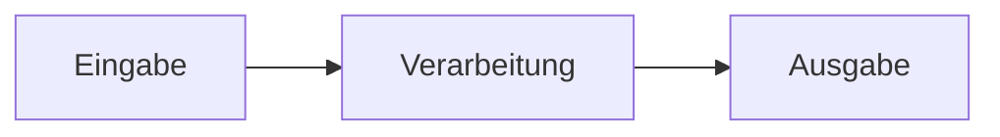

# Mitmachen

Korrekturen sind willkommen, auch einzeilige. Eine Prüfungssammlung, in der eine
Aussage falsch ist, richtet mehr Schaden an als eine, in der sie fehlt — wer einen
Fehler findet und ihn meldet, tut allen einen Gefallen.

## Der schnellste Weg

Nur ein Tippfehler oder eine falsche Zahl? Auf der
[Website](https://ftrauernicht.github.io/fachinformatiker-anwendungsentwicklung/) steht
über jeder Seite ein Stift-Symbol. Es öffnet die Datei direkt im GitHub-Editor; von dort
sind es zwei Klicks bis zum Pull Request.

Für alles Größere lohnt sich die lokale Einrichtung.

## Lokal einrichten

Gebraucht werden Node 20+ und Python 3.11+.

```bash
git clone https://github.com/ftrauernicht/fachinformatiker-anwendungsentwicklung.git
cd fachinformatiker-anwendungsentwicklung

npm install                       # Prüfwerkzeuge
python -m venv .venv              # Website
.venv/Scripts/pip install -r requirements.txt      # Windows
# .venv/bin/pip install -r requirements.txt        # Linux, macOS
```

Website lokal ansehen — sie lädt bei jeder Änderung neu:

```bash
mkdocs serve
```

## Vor jedem Pull Request

```bash
npm run check
```

Das ist derselbe Satz Prüfungen, den die CI fährt:

| Befehl | prüft |
|---|---|
| `npm run lint:md` | Markdown-Formatierung; `npm run lint:md:fix` repariert das meiste selbst |
| `npm run lint:spell` | Rechtschreibung gegen ein deutsches und ein englisches Wörterbuch |
| `npm run check:toc` | ob die Inhaltsverzeichnisse noch zu den Überschriften passen |
| `npm run check:content` | Links, Anker, Fußnoten, ungenutzte Bilder, Sprachparität |
| `npm run docs:build` | ob die Website ohne kaputten Link baut |

Wenn `check:toc` meckert, hilft `npm run build:toc` — das Inhaltsverzeichnis wird aus den
Überschriften neu erzeugt und muss nicht von Hand gepflegt werden.

## Was beim Schreiben zu beachten ist

**Quellen gehören dazu.** Jede fachliche Aussage bekommt eine Fußnote:

```markdown
### DHCP

[^3]
DHCP weist Geräten im Netz automatisch eine IP-Adresse zu.

[^3]: <https://de.wikipedia.org/wiki/Dynamic_Host_Configuration_Protocol>
```

Ohne Beleg lässt sich später nicht entscheiden, welche von zwei widersprüchlichen
Darstellungen stimmt. Genau das war der Grund für einen Teil der Fehler, die 2026
korrigiert wurden.

**Überschriften müssen innerhalb einer Seite eindeutig sein.** Nicht dreimal „Vorteile",
sondern „Vorteile von RAID 0", „Vorteile von RAID 1", „Vorteile von RAID 5". GitHub und
der Website-Generator nummerieren Wiederholungen unterschiedlich durch (`-1` gegen `_1`),
ein Link darauf funktioniert also immer nur an einer der beiden Stellen. `check:content`
weist darauf hin.

**Bilder kommen ins Repository, nicht von fremden Servern.** Ein ``
funktioniert genau so lange, wie die andere Seite die Datei nicht verschiebt. Neue Bilder
gehören nach `docs/assets/img/` und mit Quelle, Urheber und Lizenz in
[`docs/bildnachweise.md`](docs/bildnachweise.md). Fremde Bilder ohne freie Lizenz gehören
gar nicht hinein — dann lieber ein eigenes
[Mermaid](https://mermaid.js.org/)-Diagramm, das rendert auf GitHub und auf der Website:

````markdown

````

**Ein Fachbegriff, den die Rechtschreibprüfung nicht kennt, ist meistens ein Tippfehler.**
Erst prüfen, dann in `.cspell/fiae-fachbegriffe.txt` eintragen. Ein Wort dort schaltet die
Prüfung dafür im ganzen Repository ab.

**Zeilen im Fließtext nicht umbrechen.** Ein Absatz steht in einer Zeile. Wer mitten im
Satz umbricht, macht jeden späteren Diff unlesbar, weil sich der ganze Absatz verschiebt.

## Deutsch und Englisch

Die deutsche Fassung ist maßgeblich — die Prüfung ist auf Deutsch. Die englische ist eine
maschinelle Übersetzung, die nur teilweise gegengelesen wurde.

Wer die deutsche Fassung ändert, sollte die englische mitziehen. Wenn das nicht geht, ist
das kein Grund, den Pull Request zurückzuhalten: schreib es dazu, dann bleibt es sichtbar.
`check:content` meldet Seiten, die es nur in einer Sprache gibt.

Neue Kapitel müssen zusätzlich in `PAGE_MAP` in `tools/check_content.py` eingetragen
werden, sonst kann die Paritätsprüfung sie nicht zuordnen.

## Commit-Nachrichten

[Conventional Commits](https://www.conventionalcommits.org/de/):

```text
fix(content): Normalform-Beispiel korrigiert
feat(de): Zustandsdiagramm ergänzt
docs(readme): Aufbau beschrieben
```

Gebräuchlich sind `feat`, `fix`, `docs`, `refactor`, `chore`, `ci`, `build`. Als Scope
eignet sich das Kapitel oder die Sprache. Ein Satz zum *Warum* im Rumpf ist mehr wert als
eine Aufzählung dessen, was der Diff ohnehin zeigt.

## Herkunft und Lizenz

Diese Sammlung ist ein Fork von
[LakayFTW/exam-prep-fiae-2023](https://github.com/LakayFTW/exam-prep-fiae-2023). Das
ursprüngliche Repository hat **keine Lizenzdatei**, womit die Inhalte formal beim
jeweiligen Urheber liegen und nicht ohne Weiteres weiterverwendet werden dürfen. Solange
das so ist, kann auch dieser Fork keine Lizenz vergeben.

Wer hier beiträgt, tut das unter denselben Voraussetzungen. Bitte reich nichts ein, was du
nicht selbst geschrieben hast oder was nicht unter einer freien Lizenz steht — kopierte
Absätze aus Lehrbüchern oder von Firmenwebsites gehören nicht hinein. Ein Link in einer
Fußnote leistet dasselbe und ist unproblematisch.
