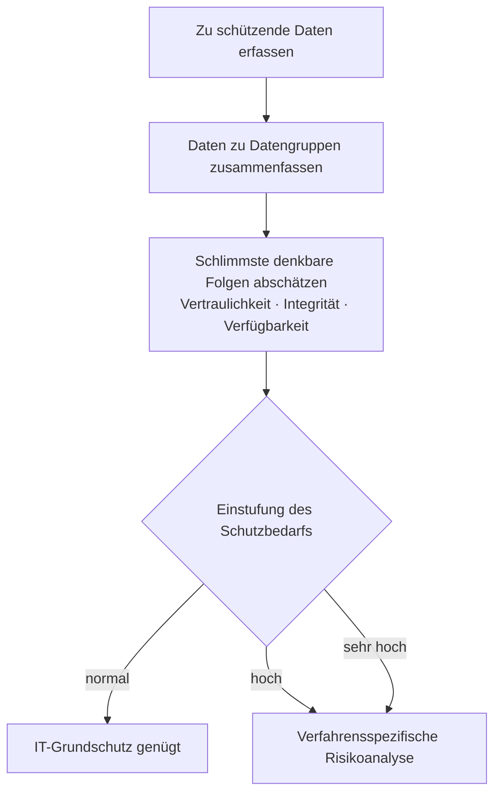

# IT-Schutz und IT-Sicherheit

## Inhaltsverzeichnis

- [Datenschutz](#datenschutz)
  - [Art. 32 der DSGVO - Sicherheit und Verarbeitung](#art-32-der-dsgvo---sicherheit-und-verarbeitung)
  - [3 Aspekte der It-Sicherheit](#3-aspekte-der-it-sicherheit)
  - [Authentifizierung, Authentisierung, Autorisierung](#authentifizierung-authentisierung-autorisierung)
  - [ISMS (Informationssicherheitsmanagementsystem)](#isms-informationssicherheitsmanagementsystem)
- [Schutzbedarfsanalyse](#schutzbedarfsanalyse)
  - [Identifikation der zu schützenden Daten](#identifikation-der-zu-schützenden-daten)
  - [Zusammenfassung der Daten zu Datengruppen](#zusammenfassung-der-daten-zu-datengruppen)
  - [Bestimmen der schlimmsten möglichen Folgen des Verlustes](#bestimmen-der-schlimmsten-möglichen-folgen-des-verlustes)
  - [Einordnung in eine Schutzbedarfskategorie](#einordnung-in-eine-schutzbedarfskategorie)
  - [Verstoß gegen Gesetze, Vorschriften und Verträge](#verstoß-gegen-gesetze-vorschriften-und-verträge)
    - [Datenschutzgesetze](#datenschutzgesetze)
    - [Vorschriften zur Mitbestimmung](#vorschriften-zur-mitbestimmung)
    - [Verträge](#verträge)
- [Symmetrische Verschlüsselung](#symmetrische-verschlüsselung)
  - [Verfahren](#verfahren)
  - [Vorteile der symmetrischen Verschlüsselung](#vorteile-der-symmetrischen-verschlüsselung)
  - [Nachteile der symmetrischen Verschlüsselung](#nachteile-der-symmetrischen-verschlüsselung)
- [Asymmetrische Verschlüsselung](#asymmetrische-verschlüsselung)
  - [Vorteile der asymmetrischen Verschlüsselung](#vorteile-der-asymmetrischen-verschlüsselung)
  - [Nachteile der asymmetrischen Verschlüsselung](#nachteile-der-asymmetrischen-verschlüsselung)
- [2FA - 2 Faktor Authentifizierung](#2fa---2-faktor-authentifizierung)
  - [Beispiele 2FA](#beispiele-2fa)
  - [Authentisieren](#authentisieren)
  - [Authentifizieren](#authentifizieren)
  - [Autorisieren](#autorisieren)
  - [Arten der Authentisierung](#arten-der-authentisierung)
    - [Wissen](#wissen)
      - [Beispiele zur Authentifikation anhand von Wissen](#beispiele-zur-authentifikation-anhand-von-wissen)
    - [Besitz](#besitz)
      - [Beispiele zur Authentifikation anhand von Besitz](#beispiele-zur-authentifikation-anhand-von-besitz)
    - [Körperliche Merkmale / Biometrie](#körperliche-merkmale--biometrie)
      - [Beispiele zur Authentifikation anhand von Biometrie](#beispiele-zur-authentifikation-anhand-von-biometrie)
- [Angriffe und Gegenmaßnahmen](#angriffe-und-gegenmaßnahmen)
  - [Man-in-the-Middle](#man-in-the-middle)
  - [SQL-Injection](#sql-injection)
  - [Cross-Site-Scripting](#cross-site-scripting)
  - [Cross-Site-Request-Forgery](#cross-site-request-forgery)
  - [Denial of Service und DDoS](#denial-of-service-und-ddos)
  - [Social Engineering und Phishing](#social-engineering-und-phishing)
  - [Die Angriffe im Überblick](#die-angriffe-im-überblick)
- [Kerberos](#kerberos)
- [Rechtsrahmen seit 2024](#rechtsrahmen-seit-2024)
  - [NIS-2-Umsetzungsgesetz](#nis-2-umsetzungsgesetz)
  - [EU-Verordnung über künstliche Intelligenz](#eu-verordnung-über-künstliche-intelligenz)

## Datenschutz

- DSGVO - Datenschutz-Grundverordnung
- BDSG - Bundesdatenschutzgesetz

### Art. 32 der DSGVO - Sicherheit und Verarbeitung

[^1]

1. Pseudonymisierung und Verschlüsselung personenbezogener Daten
2. die Fähigkeit, die Vertraulichkeit, die Integrität und Belastbarkeit der Systeme und Dienste im Zusammenhang mit der Verarbeitung auf Dauer sicherzustellen
3. die Fähigkeit, die Verfügbarkeit der personenbezogenen Daten und den Zugang zu ihnen bei einem physischen oder technischen Zwischenfall rasch wiederherzustellen
4. ein Verfahren zur regelmäßigen Überprüfung, Bewertung und Evaluierung der Wirksamkeit der technischen und organisatorischen Maßnahmen zur Gewährleistung der Sicherheit der Verarbeitung

Zusätzlich muss man bei der Einhaltung und Beurteilung dieser Vorgaben an die Risiken denken und einhalten, die mit der Verarbeitung verbunden sind.

### 3 Aspekte der It-Sicherheit

- Vertraulichkeit
- Integrität
- Verfügbarkeit

### Authentifizierung, Authentisierung, Autorisierung

[^2]

- Authentifizierung = Prüfung der angegebenen Daten
- Authentisierung = Eine Person legt Informationen vor um sich zu identifizieren
- Autorisierung = Wenn Informationen richtig sind gibt Gegenseite Zugang frei

### ISMS (Informationssicherheitsmanagementsystem)

[^3]
Die Aufstellung von Verfahren und Regeln innerhalb einer Organisation, die dazu dienen, die Informationssicherheit dauerhaft zu definieren, zu steuern, zu kontrollieren, aufrechtzuerhalten und fortlaufend zu verbessern

<br>

## Schutzbedarfsanalyse

[^4] [^5]
Bei der Schutzbedarfsanalyse wird anhand der eingesetzten Informationstechnik und der Informationen, deren Schutz bewertet je nach dem wie angemessen dies ist. Der Wert der Daten und Funktionen ist in der Regel um ein Vielfaches höher als der Wert von den IT Geräten selbst. Daher sind angemessene Sicherheitsmaßnahmen aus den Sicherheitsanforderungen der IT-Verfahren abzuleiten.

<br>



*Ablauf der Schutzbedarfsanalyse. Quelle des ursprünglichen Schaubilds:
[FU Berlin](https://tetfolio.fu-berlin.de/web/ii_555094:9).*

<br>

Der Schutzbedarf wird über die Abschätzung der schlimmsten denkbaren Folgen des Verlustes von **Vertraulichkeit**, **Integrität** und **Verfügbarkeit** ermittelt. Die Abschätzung hat gesondert für folgende sechs Schadenskategorien zu erfolgen:

- Beeinträchtigung des informationellen Selbstbestimmungsrechts
- Beeinträchtigung der persönlichen Unversehrtheit
- Beeinträchtigung der Aufgabenerfüllung
- Negative Außenwirkung
- Finanzielle Auswirkungen
- Verstoß gegen Gesetze, Vorschriften und Verträge

<br>

Hierzu betrachtet man jede Anwendung und die verarbeiteten Informationen und welche Schäden zu erwarten sind. Meist werden diesen in die Schutzklassen "normal", "hoch", "sehr hoch" kategorisiert. Wird als Ergebnis der Schutzbedarfsanalyse das gewählte IT-Verfahren in die Klasse "normal" eingestuft, reichen die Maßnahmen des IT-Grundschutzes aus. In allen anderen Fällen muss eine verfahrensspezifische Risikoanalyse durchgeführt werden.

<br>

**Bei der Schutzbedarfsanalyse werden folgende Schritte angewendet:**

1. Identifikation der zu schützenden Daten
2. Zusammenfassung der Daten zu Datengruppen (optional)
3. Bestimmen der schlimmsten möglichen Folgen
4. Einordnung in eine Schutzbedarfskategorie

<br>

### Identifikation der zu schützenden Daten

An erster Stelle steht die Identifikation aller Daten, die innerhalb des analysierten IT-Verfahrens verarbeitet bzw. gespeichert werden.
> **Beispiel:** Vorname, Nachname, Straße, Hausnummer, Postleitzahl und Ort, Forschungsergebnisse, Patentanmeldung

<br>

### Zusammenfassung der Daten zu Datengruppen

Häufig lassen sich mehrere Einzeldaten inhaltlich zu Datengruppen zusammenfassen. Die weiteren Schritte sind dann stets auf diese Datengruppen anzuwenden und nicht mehr auf die dort enthaltenen Einzeldaten.
>**Beispiel:**  
Kontaktdaten
(Vorname, Nachname, Strasse, Hausnummer, PLZ und Ort)<br>
Forschungsergebnisse<br>
Patentanmeldung

<br>

### Bestimmen der schlimmsten möglichen Folgen des Verlustes

Jede Datengruppe ist jeweils bezüglich der genannten sechs Schadenskategorien zu bewerten. Für jede der sechs Schadenskategorien ist zu überlegen, welche Folgen die Beeinträchtigung der Schutzziele **Vertraulichkeit**, **Integrität**, **Verfügbarkeit** im schlimmsten Fall hätte.

<br>

>Beispiel Vertraulichkeit:<br>
**Vorfall:** Unbefugte erlangen Kenntnis von Personaldaten.<br>
**Folgen:** Der Umgang mit Kollegen und Kolleginnen kann beeinträchtigt werden.

<br>

>Beispiel Integrität:<br>
**Vorfall:** Forschungsdaten werden unbefugt verändert.<br>
**Folgen:** Es muss von einem überregionalen Ansehensverlust ausgegangen werden.

<br>

>Beispiel Verfügbarkeit:<br>
**Vorfall:** Personaldaten stehen nicht zur Verfügung.<br>
**Folgen:** Es kommt zu Verzögerungen bei der Auszahlung der Bezüge.

<br>

### Einordnung in eine Schutzbedarfskategorie

Die in den Abschätzungsüberlegungen festgestellten schlimmsten Folgen müssen anhand der Kategorien in der Bewertungstabelle eingestuft werden.

**Hier ist ein Beispiel für die Einstufung beim Verlust von Vertraulichkeit in einer Tabelle:**

<table cellspacing="2" cellpadding="2">
  <tbody>
    <tr>
      <td colspan="1" rowspan="2"><b>Schadenskategorien</b></td>
      <td colspan="1" rowspan="2">Bedrohung</td>
      <td colspan="3" rowspan="1">Abschätzung des Schadens&nbsp;</td>
    </tr>
    <tr>
      <td>normal</td>
      <td>hoch</td>
      <td>sehr hoch</td>
    </tr>
    <tr>
      <td>
        Beeinträchtigung des informationellen Selbstbestimmungsrechts
      </td>
      <td>Bekannt werden der Daten für Unberechtigte</td>
      <td>X</td>
      <td><br></td>
      <td><br></td>
    </tr>
    <tr>
      <td>Beeinträchtigung der persönlichen Unversehrtheit</td>
      <td>Missbrauch der Daten…</td>
      <td>X</td>
      <td><br></td>
      <td><br></td>
    </tr>
    <tr>
      <td>Beeinträchtigung der Aufgaben-erfüllung</td>
      <td>Die Kenntnis der Daten durch Unberechtigte…</td>
      <td>X</td>
      <td><br></td>
      <td><br></td>
    </tr>
    <tr>
      <td>Negative Außenwirkung</td>
      <td>Missbrauch der Daten…</td>
      <td><br></td>
      <td>X</td>
      <td><br></td>
    </tr>
    <tr>
      <td>Finanzielle Auswirkungen</td>
      <td>Missbrauch der Daten…</td>
      <td>X</td>
      <td><br></td>
      <td><br></td>
    </tr>
    <tr>
      <td colspan="2" rowspan="1">
        <strong>daraus resultierender Schutzbedarf:</strong>
      </td>
      <td colspan="3" rowspan="1"><strong>hoch</strong></td>
    </tr>
  </tbody>
</table>

<br>

### Verstoß gegen Gesetze, Vorschriften und Verträge

Hier müssen alle Regelungen betrachtet werden, die für das betreffende IT-Verfahren relevant sind.

<br>

#### Datenschutzgesetze
>
>**Beispiel:**<br>
Informationsverarbeitungsgesetz (IVG)<br>
Bundesdatenschutzgesetz (BDSG)<br>
Datenschutz-Grundverordnung (DSGVO)

<br>

#### Vorschriften zur Mitbestimmung
>
>**Beispiel:** IT-Grundsatzdienstvereinbarung

<br>

#### Verträge
>
>**Beispiel:** Vertrag über die Zusammenarbeit mit einer externen Firma

<br>

## Symmetrische Verschlüsselung

In der Symmetrischen Verschlüsselung verwenden beide Teilnehmer den gleichen Schlüssel, dieser ist für die Verschlüsselung wie auch für die Entschlüsselung Zuständig.

### Verfahren

- AES
- DES
- Triple-DES
- IDEA
- Blowfish
- QUISCI
- Twofish

Diese Verfahren sind auch bei großen Datenmengen sehr schnell.

### Vorteile der symmetrischen Verschlüsselung

- Einfaches Schlüsselmanagement da nur ein Schlüssel für Ent- und Verschlüsselung gebraucht wird.
- Hohe Geschwindigkeit für Ent- und Verschlüsselung.

### Nachteile der symmetrischen Verschlüsselung

- Nur ein Schlüssel für Ver- und Entschlüsselung, Schlüssel darf nicht in unbefugte Hände gelangen.
- Schlüssel muss über einen sicheren Weg übermittelt werden.
- Anzahl der Schlüssel bezogen auf die Anzahl der Teilnehmer wächst quadratisch.

## Asymmetrische Verschlüsselung

Die Asymmetrische Verschlüsselung wird auch Public-Key-Verfahren genannt. Hier gibt es nicht nur einen Schlüssel sondern gleich zwei, dieses sogenannte Schlüsselpaar setzt sich aus einem privaten Schlüssel (Private Key) und einem öffentlichen Schlüssel (Public Key) zusammen. Mit dem Private Key, werden Daten Entschlüsselt oder eine digitale Signatur erzeugt. Mit dem Public Key kann man Daten verschlüsseln und erzeugte Signaturen auf ihren Authentizität überprüfen. Dieses Verfahren ist sehr langsam und eignet sich daher nur für kleine Datenmengen.

### Vorteile der asymmetrischen Verschlüsselung

- Relativ hohe Sicherheit.
- Es werden nicht so viele Schlüssel benötigt, wie bei einem symmetrischen Verschlüsselungsverfahren, somit weniger Aufwand der Geheimhaltung des Schlüssels.
- Kein Schlüsselverteilungsproblem, da Public Key für jeden ohne Probleme zu erreichen ist.
- Möglichkeit der Authentifikation durch elektronische Unterschriften (digitale Signaturen).

### Nachteile der asymmetrischen Verschlüsselung

- Arbeiten sehr langsam ca. 10000 Mal langsamer als symmetrische.
- Große benötigte Schlüssellänge.
- Probleme bei mehreren Empfänger einer verschlüsselten Nachricht, da jedes Mal die Nachricht extra verschlüsselt werden muss.
- Sicherheitsrisiko durch für jeden zugänglichen Public Key -> Man in the Middle.

## 2FA - 2 Faktor Authentifizierung

[^6]
Die Zwei-Faktor-Authentisierung auch Authentifizierung genannt, bezeichnet den Identitätsnachweis eines Nutzers mittels einer Kombination zweier unterschiedlicher und insbesondere unabhängiger Komponenten.

### Beispiele 2FA

- Bankkarte + PIN
- Fingerabdruck
- Zugangskarten
- TAN beim Online-Banking

### Authentisieren

Das allgemeine "Anmelden" bei einem Dienst des Benutzers nennt man Authentisierung.
Der Benutzer muss sich beim Dienst Authentisieren.

### Authentifizieren

[^7]
Wenn der Benutzer sich Authentisiert hat, und die Kontrolle erfolgreich abgeschlossen ist, kann der Dienst oder Server den Benutzer erfolgreich Authentifizieren.

### Autorisieren

Sobald der Benutzer erfolgreich Authentifiziert ist und der Benutzer authentifiziert ist, können Berechtigungen verteilt werden, was man Autorisieren nennt.
Das gleiche System lässt sich auch auf Gebäude oder ähnlichem Anwenden.

### Arten der Authentisierung

[^8]
Die Authentisierung kann über mehrere Arten erreicht werden.

#### Wissen

Charakteristika:

- kann vergessen werden
- kann dupliziert, verteilt, weitergegeben oder verraten werden
- kann eventuell erraten werden
  
##### Beispiele zur Authentifikation anhand von Wissen

- Passwort
- PIN
- Sicherheitsfrage

#### Besitz

Charakteristika:

- Erstellung eines Merkmals unterliegt vergleichsweise hohen Kosten.
- Verwaltung des Besitzes ist unsicher und mit Aufwand verbunden (muss mitgeführt werden)
- kann verloren gehen
- kann gestohlen werden
- kann übergeben, weitergereicht, dupliziert werden
- kann ersetzt werden

##### Beispiele zur Authentifikation anhand von Besitz

- Chipkarte
- Magnetstreifenkarte
- RFID-Karte/Chip
- Physischer Schlüssel
- Schlüssel-Codes auf einer Festplatte
- SIM-Karte beim mTAN-Verfahren
- Zertifikat z.B. bei SSL
- TAN
- One Time PIN
- USB-Stick mit Passworttresor

#### Körperliche Merkmale / Biometrie

Charakteristika:

- wird durch Personen immer mitgeführt
- kann nicht an andere Personen weitergegeben werden
- benötigt zum Erkennen spezielle Vorrichtung
- ist im Laufe der Zeit oder durch Unfälle veränderlich
- kann nicht ersetzt werden
- kann Probleme beim Datenschutz aufwerfen

##### Beispiele zur Authentifikation anhand von Biometrie

- Fingerabdruck
- Gesichtserkennung
- Tippverhalten
- Stimmerkennung
- Iriserkennung (Augen)
- Retinamerkmale (Augenhintergrund)
- Handschrift (Unterschrift)
- Handgeometrie (Handflächenscanner)
- Handlinienstruktur
- Erbinformationen (DNA)

## Angriffe und Gegenmaßnahmen

Der Prüfungskatalog nennt seit 2025 Man-in-the-Middle, SQL-Injection und DDoS ausdrücklich. Die drei stehen hier zusammen mit den anderen Angriffen, die in Aufgaben regelmäßig vorkommen. Als Nachschlagewerk für Webanwendungen dient darüber hinaus die Liste der OWASP Top Ten.[^9]

### Man-in-the-Middle

Der Angreifer klinkt sich in die Verbindung zwischen zwei Partnern ein und gibt sich gegenüber jedem als der jeweils andere aus. Er kann mitlesen und verändern, ohne dass einer der beiden es bemerkt.[^10]

Typische Wege dorthin sind ein gefälschter WLAN-Zugangspunkt, ARP-Spoofing im lokalen Netz oder ein manipulierter DNS-Eintrag.

Gegenmaßnahmen: durchgängige Verschlüsselung mit TLS, Prüfung des Zertifikats gegen eine vertrauenswürdige Stelle, HSTS, Zertifikatsanheftung. Entscheidend ist nicht die Verschlüsselung allein, sondern die **Authentizität des Gegenübers** — eine verschlüsselte Verbindung zum Angreifer nützt nichts.

### SQL-Injection

Eingaben eines Nutzers landen ungeprüft in einer SQL-Anweisung und ändern deren Struktur. Aus einer Abfrage nach einem Benutzernamen wird so eine Abfrage, die alle Datensätze liefert oder eine Tabelle löscht.[^11]

```sql
-- Anfällig: die Eingabe wird in den Text der Anweisung eingesetzt
SELECT * FROM Benutzer WHERE Name = 'EINGABE';

-- Eingabe: ' OR '1'='1
SELECT * FROM Benutzer WHERE Name = '' OR '1'='1';
```

Gegenmaßnahmen, in dieser Reihenfolge:

1. **Vorbereitete Anweisungen mit Platzhaltern** (Prepared Statements). Der Datenbankserver kennt die Struktur der Anweisung, bevor er die Daten sieht — eine Eingabe kann sie danach nicht mehr verändern.
2. Eingaben gegen eine Positivliste prüfen, nicht gegen eine Liste verbotener Zeichen.
3. Für die Anwendung ein Datenbankkonto mit möglichst wenigen Rechten verwenden.
4. Fehlermeldungen der Datenbank nicht an den Nutzer durchreichen.

Maskieren von Sonderzeichen allein genügt nicht — das ist die häufigste falsche Antwort auf diese Frage.

### Cross-Site-Scripting

Der Angreifer bringt fremden Skriptcode in eine Seite, die andere Nutzer aufrufen. Das Skript läuft dann im Browser des Opfers mit den Rechten der angegriffenen Seite und kann etwa das Sitzungsmerkmal auslesen.[^12]

Unterschieden werden die gespeicherte Variante — der Code steht dauerhaft in der Datenbank, etwa in einem Kommentar — und die reflektierte, bei der er über einen präparierten Link in die Antwort gelangt.

Gegenmaßnahmen: Ausgaben kontextgerecht maskieren, eine Content Security Policy setzen, Sitzungsmerkmale mit dem Kennzeichen `HttpOnly` versehen.

### Cross-Site-Request-Forgery

Das Opfer ist bei einer Anwendung angemeldet und ruft nebenbei eine fremde Seite auf. Diese schickt in seinem Namen eine Anfrage an die Anwendung — der Browser hängt das gültige Sitzungsmerkmal automatisch an.[^13]

Gegenmaßnahmen: ein zufälliges Merkmal je Formular, das der Server wiedererkennt, das Kennzeichen `SameSite` am Sitzungsmerkmal, und für ändernde Vorgänge grundsätzlich POST statt GET.

### Denial of Service und DDoS

Ein Dienst wird mit Anfragen überlastet, bis er für reguläre Nutzer nicht mehr erreichbar ist. Angegriffen wird das Schutzziel **Verfügbarkeit**.[^14]

Beim verteilten Angriff (DDoS) kommen die Anfragen von vielen übernommenen Rechnern gleichzeitig; sie sind dadurch nicht mehr über eine einzelne Adresse zu sperren. Verbreitet ist zusätzlich die Verstärkung: Der Angreifer schickt kleine Anfragen mit gefälschter Absenderadresse an fremde Dienste, deren große Antworten dann beim Opfer landen.

Gegenmaßnahmen: Begrenzung der Anfragerate, Filter beim Netzbetreiber, Auslieferung über ein verteiltes Netz, und für den Ernstfall ein Notfallplan mit Ansprechpartnern.

### Social Engineering und Phishing

Der Angriff richtet sich nicht gegen die Technik, sondern gegen den Menschen: eine gefälschte Nachricht der Geschäftsführung, ein angeblicher Anruf der IT-Abteilung, ein Besucher mit Paket und freundlichem Lächeln.[^15]

Gegenmaßnahmen sind entsprechend organisatorisch: Schulung, ein festgelegter Rückrufweg bei Zahlungsanweisungen, das Vier-Augen-Prinzip — und technisch die Zwei-Faktor-Authentifizierung, die ein erbeutetes Kennwort allein wertlos macht.

### Die Angriffe im Überblick

| Angriff | Verletztes Schutzziel | Wichtigste Gegenmaßnahme |
|---|---|---|
| Man-in-the-Middle | Vertraulichkeit, Integrität | TLS mit geprüftem Zertifikat |
| SQL-Injection | alle drei | vorbereitete Anweisungen |
| Cross-Site-Scripting | Vertraulichkeit, Integrität | Ausgabe maskieren, CSP |
| Cross-Site-Request-Forgery | Integrität | Formularmerkmal, `SameSite` |
| DDoS | Verfügbarkeit | Ratenbegrenzung, Filter beim Betreiber |
| Social Engineering | alle drei | Schulung, Zwei-Faktor-Authentifizierung |

## Kerberos

Kerberos ist ein Netzwerkprotokoll zur Authentifizierung in unsicheren Netzen und seit 2025 im Prüfungskatalog. Es ist die Grundlage der Anmeldung in Windows-Domänen.[^16]

Der Kern ist ein vertrauenswürdiger Dritter, das **Key Distribution Center**. Es besteht aus einem Authentifizierungsdienst und einem Ticket-Dienst.

1. Der Nutzer meldet sich einmal beim Authentifizierungsdienst an und erhält ein **Ticket Granting Ticket**.
2. Mit diesem Ticket fordert er beim Ticket-Dienst ein Ticket für einen bestimmten Dienst an.
3. Dieses Dienst-Ticket legt er dem Dienst vor. Der prüft es, ohne beim KDC nachzufragen.

Zwei Eigenschaften sind prüfungsrelevant: Das **Kennwort wird nie über das Netz übertragen** — es dient nur zur Entschlüsselung der Antwort des KDC. Und Tickets sind zeitlich begrenzt, weshalb die Uhren aller Beteiligten übereinstimmen müssen; eine Abweichung von wenigen Minuten lässt die Anmeldung scheitern.

Der Vorteil ist die einmalige Anmeldung für viele Dienste, der Nachteil die zentrale Abhängigkeit: Fällt das KDC aus, meldet sich niemand mehr an.

## Rechtsrahmen seit 2024

Zwei Regelwerke sind nach der letzten großen Überarbeitung dieser Sammlung in Kraft getreten und betreffen die IT-Sicherheit unmittelbar.

### NIS-2-Umsetzungsgesetz

Das deutsche Umsetzungsgesetz zur europäischen NIS-2-Richtlinie wurde am 6. Dezember 2025 verkündet und gilt seitdem ohne Übergangsfrist. Betroffen sind rund 29.500 Unternehmen — deutlich mehr als zuvor, weil nicht mehr nur Betreiber kritischer Anlagen erfasst sind, sondern Einrichtungen ab bestimmten Größen in achtzehn Sektoren.[^17]

Die Pflichten stehen in § 30 BSIG: Risikomanagement in zehn benannten Bereichen, darunter Sicherheit der Lieferkette, Notfallmanagement, Kryptografie und Mehrfaktor-Authentifizierung.[^18] Dazu kommen die Registrierung beim BSI und eine gestufte Meldepflicht bei erheblichen Sicherheitsvorfällen:

| Frist | Was zu melden ist |
|---|---|
| 24 Stunden | Erstmeldung, ob ein erheblicher Vorfall vorliegt |
| 72 Stunden | Bewertung mit Schweregrad und Auswirkungen |
| 1 Monat | Abschlussmeldung mit Ursache und Gegenmaßnahmen |

Neu ist außerdem die persönliche Verantwortung der Geschäftsleitung: Sie muss die Maßnahmen billigen, überwachen und sich schulen lassen.

### EU-Verordnung über künstliche Intelligenz

Die KI-Verordnung ist am 1. August 2024 in Kraft getreten und gilt gestaffelt. Verbotene Praktiken und die Pflicht zur KI-Kompetenz gelten seit dem 2. Februar 2025, die Regeln für Modelle mit allgemeinem Verwendungszweck seit dem 2. August 2025, der überwiegende Teil ab dem 2. August 2026.[^19]

Sie folgt einem risikobasierten Ansatz mit vier Stufen:

| Stufe | Beispiele | Folge |
|---|---|---|
| **Unannehmbares Risiko** | soziale Bewertung von Menschen, Emotionserkennung am Arbeitsplatz | verboten |
| **Hohes Risiko** | Auswahl von Bewerbern, Kreditwürdigkeit, Medizinprodukte | umfangreiche Pflichten, Konformitätsbewertung |
| **Begrenztes Risiko** | Chatbots, erzeugte Bilder und Texte | Transparenzpflicht: erkennbar machen, dass eine KI im Spiel ist |
| **Minimales Risiko** | Spamfilter, Empfehlungen im Warenkorb | keine besonderen Pflichten |

Für die Ausbildung wichtig ist Artikel 4: Wer KI-Systeme betreibt oder anbietet, muss dafür sorgen, dass die damit befassten Beschäftigten über ausreichende KI-Kompetenz verfügen. Das gilt seit Februar 2025 und ist keine Frage der Unternehmensgröße.

[^1]: <https://dsgvo-gesetz.de/art-32-dsgvo/>
[^2]: <https://www.dr-datenschutz.de/authentisierung-authentifizierung-und-autorisierung/>
[^3]: <https://de.wikipedia.org/wiki/Information_Security_Management_System>
[^4]: <https://de.wikipedia.org/wiki/IT-Grundschutz#Schutzbedarfsfeststellung>
[^5]: <https://tetfolio.fu-berlin.de/web/ii_555094:9>
[^6]: <https://de.wikipedia.org/wiki/Zwei-Faktor-Authentisierung>
[^7]: <https://de.wikipedia.org/wiki/Authentifizierung>
[^8]: <https://de.wikipedia.org/wiki/Authentifizierung#Methoden>
[^9]: <https://owasp.org/www-project-top-ten/>
[^10]: <https://de.wikipedia.org/wiki/Man-in-the-Middle-Angriff>
[^11]: <https://de.wikipedia.org/wiki/SQL-Injection>
[^12]: <https://de.wikipedia.org/wiki/Cross-Site-Scripting>
[^13]: <https://de.wikipedia.org/wiki/Cross-Site-Request-Forgery>
[^14]: <https://de.wikipedia.org/wiki/Denial_of_Service>
[^15]: <https://de.wikipedia.org/wiki/Social_Engineering_(Sicherheit)>
[^16]: <https://de.wikipedia.org/wiki/Kerberos_(Informatik)>
[^17]: <https://www.bsi.bund.de/dok/nis-2>
[^18]: <https://www.gesetze-im-internet.de/bsig_2025/__30.html>
[^19]: <https://digital-strategy.ec.europa.eu/de/policies/regulatory-framework-ai>
