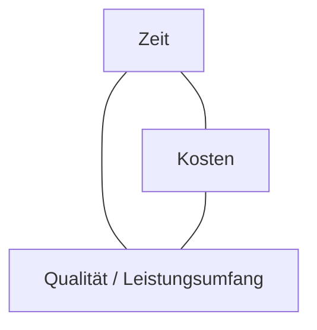
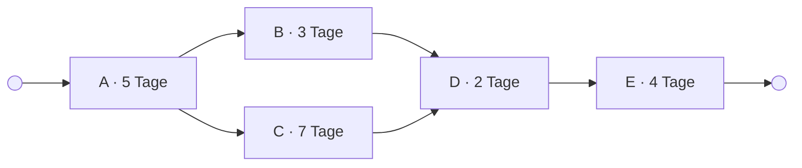

# Projektmanagement

## Inhaltsverzeichnis

- [Managementbereiche](#managementbereiche)
- [Das Magische Dreieck des Projektmanagements](#das-magische-dreieck-des-projektmanagements)
- [Vorgehensweisen](#vorgehensweisen)
  - [Konventionelle (sequenzielle) Vorgehensweise](#konventionelle-sequenzielle-vorgehensweise)
  - [Agile (flexible) Vorgehensweise](#agile-flexible-vorgehensweise)
  - [Entwicklungsmethode](#entwicklungsmethode)
  - [Entwicklungsphilosophie](#entwicklungsphilosophie)
- [Netzplan](#netzplan)
  - [Hauptfunktion des Netzplans](#hauptfunktion-des-netzplans)
  - [Die Elemente eines Netzplans](#die-elemente-eines-netzplans)
- [Gantt-Diagramm](#gantt-diagramm)

## Managementbereiche

- Qualitätsmanagement
- Kommunikationsmanagement
- Risikomanagement
- Integrationsmanagement
- Inhalts- und Umfangsmanagement
- Terminmanagement
- Kostenmanagement
- Personalmanagement
- Beschaffungsmanagement

## Das Magische Dreieck des Projektmanagements

*Das magische Dreieck: die drei Größen hängen voneinander ab. Wer eine davon
verändert, verändert zwangsläufig mindestens eine der beiden anderen.*

[^1]

Ein Projekt ist dabei per Definition der DIN ISO 69901 ein Vorhaben, das durch folgende sieben Kriterien gekennzeichnet ist:

- Einmaligkeit des Vorhabens
- Konkrete Zielvorgaben (Kosten, Termin: definierter Start- und Endzeitpunkt, Ressourcen)
- Zeitliche, finanzielle und personelle Begrenzungen
- Interdisziplinarität der Aufgabenstellung und des Teams
- Komplexität
- Außergewöhnlichkeit
- Neuartigkeit

## Vorgehensweisen

### Konventionelle (sequenzielle) Vorgehensweise

- Wasserfallmodell
- V-Modell
- Spiralmodell
- Capability Maturity Model (Reifegradmodell)

### Agile (flexible) Vorgehensweise

- Scrum
- Kanban

### Entwicklungsmethode

- Extreme Programming
- Testgetriebene Entwicklung
- Modellgetriebene Softwareentwicklung

### Entwicklungsphilosophie

- Agile Unified Process

## Netzplan

[^2]
DIN 69 900 beschreibt die Methoden zur Termin- und Ablaufplanung im Projektmanagement, definiert Netzpläne als grafische oder tabellarische Darstellung einer Ablaufstruktur, die aus Vorgängen bzw. Ereignissen und Anordnungsbeziehungen besteht.

### Hauptfunktion des Netzplans

Ein Netzplan bildet die Grundlage für die Terminplanung und hat folgende Funktionen:

- er hilft bei der Ermittlung der Gesamtdauer eines Projekts.
- er legt die zeitliche und logische Abfolge der Vorgänge in einem Projekt fest.
- er visualisiert den kritischen Pfad und somit die Vorgänge, die das geplante Projektende gefährden können.
- er stellt mögliche Puffer bzw. Reserven in der Terminplanung dar.

*Der kritische Pfad ist A → C → D → E mit 18 Tagen. Vorgang B hat drei Tage Puffer:
er darf sich um drei Tage verschieben, ohne das Projektende zu gefährden.*

[^2]

### Die Elemente eines Netzplans

Ein Netzplan ist ein Mittel aus der Graphentheorie, das aus Knoten und Pfeilen besteht. Er kennt drei wesentliche Elemente:

- Ein Vorgang ist eine Aktivität mit einem frühesten und spätesten Anfangs- und Endzeitpunkt.
- Ein Ereignis ist ein festgelegter, beschreibbarer Zustand im Projektablauf.
- Mit einer Anordnungsbeziehung wird die logische - also fachliche, technische und personelle - und die zeitliche Abhängigkeit zwischen einzelnen Vorgängen festgelegt; sie besteht immer zwischen genau zwei Knoten.

| | | |
|---|---|---|
| **FAZ** frühester Anfangszeitpunkt | **D** Dauer | **FEZ** frühester Endzeitpunkt |
| **Nr.** Vorgangsnummer | **Vorgangsbezeichnung** | |
| **SAZ** spätester Anfangszeitpunkt | **GP** Gesamtpuffer · **FP** freier Puffer | **SEZ** spätester Endzeitpunkt |

Rechenregeln:

- Vorwärtsrechnung: `FEZ = FAZ + D`, der FAZ eines Vorgangs ist der größte FEZ seiner Vorgänger
- Rückwärtsrechnung: `SAZ = SEZ - D`, der SEZ eines Vorgangs ist der kleinste SAZ seiner Nachfolger
- `GP = SAZ - FAZ`, ein Vorgang mit `GP = 0` liegt auf dem kritischen Pfad

## Gantt-Diagramm

[^1]: <https://www.crossgo.com/de/produkt/projektmanagement>
[^2]: <https://t2informatik.de/wissen-kompakt/netzplan/>
