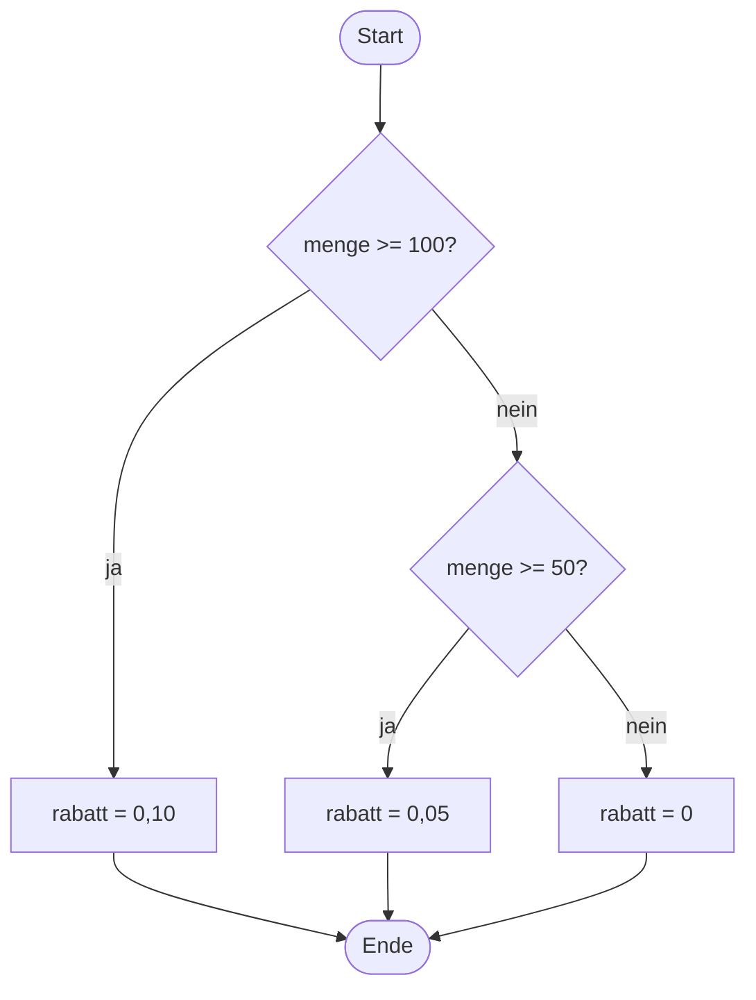

# Algorithmen

Der Prüfungsbereich „Entwicklung und Umsetzung von Algorithmen" verlangt vier Dinge: Programmcode zu lesen und eine Lösung in einer Programmiersprache zu schreiben, Algorithmen in Programmierlogik zu übertragen und grafisch darzustellen, Testszenarien und Testdaten auszuwählen sowie Abfragen zur Gewinnung und Manipulation von Daten zu erstellen.[^1] Die Prüfungszeit beträgt 90 Minuten, der Bereich zählt 10 Prozent.

Der letzte Punkt ist SQL und steht im Kapitel [Datenbanken](03-datenbanken.md). Dieses Kapitel behandelt den Rest.

## Inhaltsverzeichnis

- [Pseudocode](#pseudocode)
  - [Was Pseudocode ist](#was-pseudocode-ist)
  - [Konventionen für Pseudocode](#konventionen-für-pseudocode)
  - [Was in der Bewertung zählt](#was-in-der-bewertung-zählt)
- [Die Grundbausteine](#die-grundbausteine)
  - [Sequenz](#sequenz)
  - [Verzweigung](#verzweigung)
  - [Wiederholung](#wiederholung)
  - [Rekursion](#rekursion)
- [Laufzeit abschätzen](#laufzeit-abschätzen)
- [Suchverfahren](#suchverfahren)
  - [Lineare Suche](#lineare-suche)
  - [Binäre Suche](#binäre-suche)
- [Sortierverfahren](#sortierverfahren)
  - [Bubblesort](#bubblesort)
  - [Selectionsort](#selectionsort)
  - [Insertionsort](#insertionsort)
  - [Die drei Verfahren im Vergleich](#die-drei-verfahren-im-vergleich)

## Pseudocode

Seit dem Prüfungskatalog von 2025 sind Programmablaufplan und Struktogramm nicht mehr Bestandteil der Prüfung. Wo früher ein Struktogramm genügte, wird jetzt Pseudocode oder ein [Aktivitätsdiagramm](diagramme/07-aktivitaetsdiagramm.md) erwartet — und eine Pseudocode-Aufgabe lässt sich nicht mehr dadurch umgehen, dass man ein Diagramm zeichnet.[^2]

### Was Pseudocode ist

Pseudocode ist Programmcode ohne die Zwänge einer bestimmten Sprache.[^3] Er wird nicht übersetzt und nicht ausgeführt; er soll gelesen werden. Der Prüfungskatalog verlangt, dass die Lösung für Dritte auch ohne Kenntnis der verwendeten Programmiersprache lesbar ist.

### Konventionen für Pseudocode

Eine verbindliche Norm für Pseudocode gibt es nicht — weder allgemein noch für die IHK-Prüfung. Es gibt aber ein Verfahren, das sicher funktioniert: eine Sprache verwenden, die man beherrscht, und alles weglassen, was nur der Übersetzer braucht.

| Weglassen | Behalten |
|---|---|
| geschweifte Klammern | Einrückung, die die Blockstruktur zeigt |
| Semikolons | eine Anweisung je Zeile |
| Datentypen und Deklarationen | sprechende Variablennamen |
| `import`, `using`, Namensräume | den eigentlichen Ablauf |
| Klassengerüst und Einstiegsmethode | die geforderte Funktion oder Methode |

Aus Java

```java
public int berechneAlter(int jahr, int monat, int geburtsjahr, int geburtsmonat) {
    int alter = jahr - geburtsjahr;
    if (monat < geburtsmonat) {
        alter--;
    }
    return alter;
}
```

wird damit

```text
berechneAlter(jahr, monat, geburtsjahr, geburtsmonat)
    alter = jahr - geburtsjahr
    wenn monat < geburtsmonat
        alter = alter - 1
    gib alter zurück
```

Deutsche und englische Schlüsselwörter sind beide zulässig, gemischt werden sollten sie nicht.

### Was in der Bewertung zählt

Syntaxfehler sind unschädlich, solange der Ablauf erkennbar bleibt. Bewertet wird die Logik: Sind alle Fälle abgedeckt? Stimmen die Abbruchbedingungen? Werden Randfälle behandelt — leere Eingabe, ein einzelnes Element, Division durch null?

Der häufigste Punktverlust entsteht nicht an der Syntax, sondern an einer Schleife, die einen Durchlauf zu früh oder zu spät endet.

## Die Grundbausteine

Jeder Algorithmus lässt sich aus drei Bausteinen zusammensetzen — Sequenz, Verzweigung und Wiederholung. Das ist kein Merksatz für die Prüfung, sondern ein Satz der Informatik: der Satz von Böhm und Jacopini.

### Sequenz

Anweisungen laufen in der Reihenfolge ab, in der sie stehen.

```text
lies preis
steuer = preis * 0,19
gib preis + steuer aus
```

### Verzweigung

Eine Bedingung entscheidet, welcher von mehreren Zweigen ausgeführt wird.

```text
wenn menge >= 100
    rabatt = 0,10
sonst wenn menge >= 50
    rabatt = 0,05
sonst
    rabatt = 0
```



Die Reihenfolge der Bedingungen ist Teil der Logik: Steht `menge >= 50` zuerst, bekommt niemand mehr die zehn Prozent.

### Wiederholung

Eine Schleife führt einen Block mehrfach aus. Drei Formen sind zu unterscheiden:

| Form | Prüfung der Bedingung | Läuft mindestens | Typischer Einsatz |
|---|---|---|---|
| kopfgesteuert (`solange`, `while`) | vor dem Durchlauf | null Mal | Anzahl der Durchläufe unbekannt |
| fußgesteuert (`wiederhole … bis`, `do-while`) | nach dem Durchlauf | ein Mal | Eingabe, die mindestens einmal erfolgen muss |
| Zählschleife (`für`, `for`) | vor dem Durchlauf | null Mal | Anzahl der Durchläufe bekannt |

Eine Zählschleife ist eine Sonderform der kopfgesteuerten Schleife mit Zähler, Startwert, Endwert und Schrittweite.

### Rekursion

Eine Funktion ruft sich selbst mit einem kleineren Teilproblem auf. Jede Rekursion braucht einen **Abbruchfall**, sonst läuft der Aufrufstapel über.

```text
fakultät(n)
    wenn n <= 1
        gib 1 zurück
    gib n * fakultät(n - 1) zurück
```

Jede Rekursion lässt sich auch iterativ schreiben und umgekehrt. Rekursiv ist meist kürzer, iterativ ist sparsamer mit Speicher.

## Laufzeit abschätzen

Die O-Notation beschreibt, wie der Aufwand eines Algorithmus mit der Eingabegröße *n* wächst.[^4] Konstante Faktoren und niedrigere Terme fallen dabei weg: Aus 3*n*² + 5*n* + 12 wird O(*n*²).

| Klasse | Name | Beispiel | Schritte bei n = 1.000 |
|---|---|---|---|
| O(1) | konstant | Zugriff auf ein Feldelement über den Index | 1 |
| O(log n) | logarithmisch | binäre Suche | rund 10 |
| O(n) | linear | lineare Suche | 1.000 |
| O(n log n) | linear-logarithmisch | Mergesort, Quicksort im Mittel | rund 10.000 |
| O(n²) | quadratisch | Bubblesort, Selectionsort | 1.000.000 |
| O(2ⁿ) | exponentiell | vollständiges Durchprobieren | praktisch nicht mehr berechenbar |

Die rechte Spalte ist der Grund, warum die Frage nach der Komplexität keine Theorie ist: Zwischen O(n log n) und O(n²) liegt bei tausend Elementen der Faktor hundert, bei einer Million der Faktor fünfzigtausend.

Faustregel für das Ablesen aus fremdem Code: eine Schleife über alle Elemente ist O(n), eine Schleife in einer Schleife O(n²), eine Halbierung des Suchraums je Schritt O(log n).

## Suchverfahren

### Lineare Suche

Jedes Element wird der Reihe nach mit dem Suchwert verglichen, bis er gefunden ist oder das Feld zu Ende ist.

```text
lineareSuche(feld, gesucht)
    für i von 0 bis länge(feld) - 1
        wenn feld[i] == gesucht
            gib i zurück
    gib -1 zurück
```

Aufwand O(n). Das Verfahren setzt nichts voraus — insbesondere muss das Feld nicht sortiert sein.

### Binäre Suche

Setzt ein **sortiertes** Feld voraus. Verglichen wird mit dem mittleren Element; je nach Ergebnis wird nur noch in der linken oder rechten Hälfte weitergesucht.[^5]

```text
binäreSuche(feld, gesucht)
    links = 0
    rechts = länge(feld) - 1
    solange links <= rechts
        mitte = (links + rechts) / 2        ganzzahlig abgerundet
        wenn feld[mitte] == gesucht
            gib mitte zurück
        wenn feld[mitte] < gesucht
            links = mitte + 1
        sonst
            rechts = mitte - 1
    gib -1 zurück
```

Aufwand O(log n): Bei 1.000 Elementen sind höchstens 10 Vergleiche nötig, bei einer Million höchstens 20.

Zwei Stolperstellen, die in Prüfungsaufgaben gern eingebaut werden. Erstens die Abbruchbedingung `links <= rechts` — mit `<` wird das letzte verbleibende Element nicht mehr geprüft. Zweitens `mitte + 1` beziehungsweise `mitte - 1` beim Verkleinern des Bereichs; wer stattdessen `mitte` zuweist, bekommt eine Endlosschleife.

## Sortierverfahren

Die drei elementaren Verfahren stehen seit 2025 ausdrücklich im Prüfungskatalog.[^2] Alle drei haben im Mittel eine Laufzeit von O(n²) und sind für große Datenmengen ungeeignet — geprüft werden sie, weil sich an ihnen Schleifenlogik nachvollziehen lässt.[^6]

Als durchgehendes Beispiel dient das Feld `[5, 2, 9, 1]`.

### Bubblesort

Benachbarte Elemente werden verglichen und getauscht, wenn sie in falscher Reihenfolge stehen. Nach jedem Durchlauf steht das größte verbleibende Element am Ende — es steigt auf wie eine Blase.[^7]

```text
bubblesort(feld)
    für i von 0 bis länge(feld) - 2
        für j von 0 bis länge(feld) - 2 - i
            wenn feld[j] > feld[j + 1]
                tausche feld[j] und feld[j + 1]
```

| Durchlauf | Feld danach | Bemerkung |
|---|---|---|
| Start | 5, 2, 9, 1 | |
| 1 | 2, 5, 1, 9 | 9 steht endgültig |
| 2 | 2, 1, 5, 9 | 5 steht endgültig |
| 3 | 1, 2, 5, 9 | fertig |

Der innere Zähler läuft je Durchlauf ein Feld weniger weit, weil der hintere Teil bereits sortiert ist. Wer das `- i` vergisst, bekommt trotzdem das richtige Ergebnis, nur mit unnötigen Vergleichen. Mit einer Merkvariable, die festhält, ob in einem Durchlauf überhaupt getauscht wurde, lässt sich vorzeitig abbrechen; bei bereits sortierter Eingabe sinkt der Aufwand damit auf O(n).

### Selectionsort

In jedem Durchlauf wird das kleinste Element des unsortierten Restes gesucht und an dessen Anfang getauscht.[^8]

```text
selectionsort(feld)
    für i von 0 bis länge(feld) - 2
        kleinstes = i
        für j von i + 1 bis länge(feld) - 1
            wenn feld[j] < feld[kleinstes]
                kleinstes = j
        tausche feld[i] und feld[kleinstes]
```

| Durchlauf | Feld danach | Bemerkung |
|---|---|---|
| Start | 5, 2, 9, 1 | |
| 1 | 1, 2, 9, 5 | kleinstes ist 1, tauscht mit Position 0 |
| 2 | 1, 2, 9, 5 | 2 steht bereits richtig |
| 3 | 1, 2, 5, 9 | fertig |

Selectionsort tauscht höchstens *n* − 1 mal und damit deutlich seltener als Bubblesort. Die Anzahl der **Vergleiche** bleibt dagegen immer gleich, auch bei bereits sortierter Eingabe.

### Insertionsort

Das Feld wird in einen sortierten vorderen und einen unsortierten hinteren Teil geteilt. Das jeweils nächste Element wird an der richtigen Stelle in den vorderen Teil eingefügt — so, wie man Spielkarten auf der Hand sortiert.[^9]

```text
insertionsort(feld)
    für i von 1 bis länge(feld) - 1
        aktuell = feld[i]
        j = i - 1
        solange j >= 0 und feld[j] > aktuell
            feld[j + 1] = feld[j]
            j = j - 1
        feld[j + 1] = aktuell
```

| Durchlauf | Feld danach | Bemerkung |
|---|---|---|
| Start | 5, 2, 9, 1 | 5 gilt als sortiert |
| 1 | 2, 5, 9, 1 | 2 vor 5 eingefügt |
| 2 | 2, 5, 9, 1 | 9 bleibt, wo es ist |
| 3 | 1, 2, 5, 9 | 1 nach ganz vorn geschoben |

Insertionsort ist bei fast sortierten Daten das schnellste der drei Verfahren: Die innere Schleife bricht sofort ab, der Aufwand geht gegen O(n).

### Die drei Verfahren im Vergleich

| | Bubblesort | Selectionsort | Insertionsort |
|---|---|---|---|
| Bester Fall | O(n) mit Abbruchprüfung | O(n²) | O(n) |
| Mittlerer und schlechtester Fall | O(n²) | O(n²) | O(n²) |
| Zusätzlicher Speicher | O(1) | O(1) | O(1) |
| Anzahl der Tauschvorgänge | hoch | niedrig, höchstens n − 1 | mittel |
| Stabil | ja | nein | ja |

**Stabil** heißt: Elemente mit gleichem Sortierschlüssel behalten ihre ursprüngliche Reihenfolge zueinander. Das ist wichtig, sobald nacheinander nach mehreren Kriterien sortiert wird.

In der Praxis kommt keines der drei Verfahren zum Einsatz. Die Standardbibliotheken sortieren mit O(n log n)-Verfahren — Quicksort, Mergesort oder Mischformen daraus wie Timsort.

[^1]: <https://www.gesetze-im-internet.de/fiausbv/__14.html>
[^2]: <https://it-berufe-podcast.de/neuer-pruefungskatalog-fuer-die-ap2-als-fachinformatiker-anwendungsentwicklung-ab-2025-it-berufe-podcast-191/>
[^3]: <https://de.wikipedia.org/wiki/Pseudocode>
[^4]: <https://de.wikipedia.org/wiki/Landau-Symbole>
[^5]: <https://de.wikipedia.org/wiki/Bin%C3%A4re_Suche>
[^6]: <https://de.wikipedia.org/wiki/Sortierverfahren>
[^7]: <https://de.wikipedia.org/wiki/Bubblesort>
[^8]: <https://de.wikipedia.org/wiki/Selectionsort>
[^9]: <https://de.wikipedia.org/wiki/Insertionsort>
