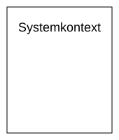
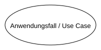
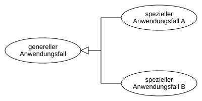
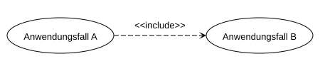
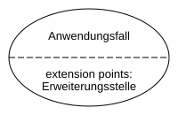

# Anwendungsfalldiagramm (Use Case)

## Inhaltsverzeichnis

- [Use-Case Diagramm](#use-case-diagramm)
  - [Keywords](#keywords)
  - [Elemente](#elemente)
    - [Systemkontext](#systemkontext)
    - [Akteur](#akteur)
    - [Anwendungsfall](#anwendungsfall)
    - [Beziehungen](#beziehungen)
      - [Assoziation/Kommunikation](#assoziationkommunikation)
      - [Multiplizität](#multiplizität)
      - [Generalisierung von Anwendungsfällen](#generalisierung-von-anwendungsfällen)
      - [Generalisierung von Akteuren](#generalisierung-von-akteuren)
      - [Include-Beziehung](#include-beziehung)
      - [Extend-Beziehung](#extend-beziehung)
      - [Extend-Beziehung mit extension point](#extend-beziehung-mit-extension-point)
      - [Anwendungsfall mit extension point](#anwendungsfall-mit-extension-point)

## Use-Case Diagramm

[^1]

Das Use-Case Diagramm wird auch Anwendungsfalldiagramm bezeichnet und ist eine der Diagrammarten der Unified Modelling Language (UML). Es stellt Anwendungsfälle und Akteure mit ihren jeweiligen Abhängigkeiten und Beziehungen dar.

### Keywords

- **Ziel** ist es, möglichst einfach zu zeigen, was man mit dem zu bauenden Softwaresystem machen will, welche Fälle der Anwendung es also gibt.
- **Akteure** werden als "Strichmännchen" dargestellt, welche sowohl Personen wie Kunden oder Administratoren als auch ein System darstellen können.
- **Anwendungsfälle** werden in Ellipsen dargestellt. Sie müssen beschrieben werden (z.B. in einem Kommentar oder einer eigenen Datei).
- **Assoziationen** zwischen Akteuren und Anwendungsfällen müssen durch Linien gekennzeichnet werden.
- **Systemgrenzen** werden durch Rechtecke gekennzeichnet.
- **include-Beziehung** vom aufrufenden Anwendungsfall zum inkludierten Anwendungsfall werden als gestrichelter Pfeil mit dem Stereotyp ``<<include>>`` dargestellt.
- **extend-Beziehung** vom erweiternden Anwendungsfall zum aufrufenden Anwendungsfall werden als gestrichelter Pfeil mit dem Stereotyp ``<<extend>>`` dargestellt. Der erweiternde Anwendungsfall kann, muss aber nicht aktiviert werden.

### Elemente

#### Systemkontext

Der Systemkontext wurde durch Systemgrenzen in Form von Rechtecken gekennzeichnet.

#### Akteur

Akteure werden als "Strichmännchen" dargestellt, welche sowohl Personen wie Kunden oder Administratoren als auch ein System darstellen können.

#### Anwendungsfall

Anwendungsfälle werden in Ellipsen dargestellt. Sie müssen (z.B. in einem Kommentar oder einer eigenen Datei) beschrieben werden.

#### Beziehungen

##### Assoziation/Kommunikation

Assoziation / Kommunikation von Akteur und Anwendungsfall

##### Multiplizität

Multiplizität von Akteur und Anwendungsfall, wobei die Voreinstellung des Akteurs 1 ist.

##### Generalisierung von Anwendungsfällen

##### Generalisierung von Akteuren

##### Include-Beziehung

Include-Beziehungen im Anwendungsfalldiagramm, wobei Anwendungsfall A den Anwendungsfall B beinhaltet

##### Extend-Beziehung

Extend-Beziehung im Anwendungsfalldiagramm, wobei Anwendungsfall A den Anwendungsfall B erweitert.

##### Extend-Beziehung mit extension point

Extend-Beziehung mit extension point, wobei Anwendungsfall A den Anwendungsfall B unter der angegebenen Bedingung erweitert.

##### Anwendungsfall mit extension point

Anwendungsfall mit extension point.

[^1]: <https://de.wikipedia.org/wiki/Anwendungsfalldiagramm>
