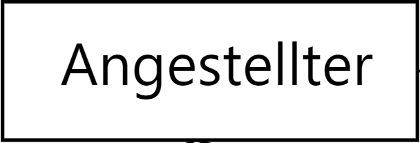
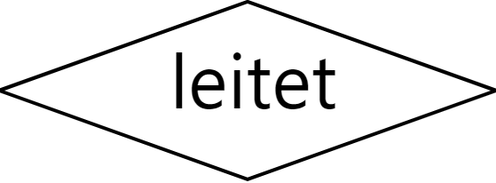
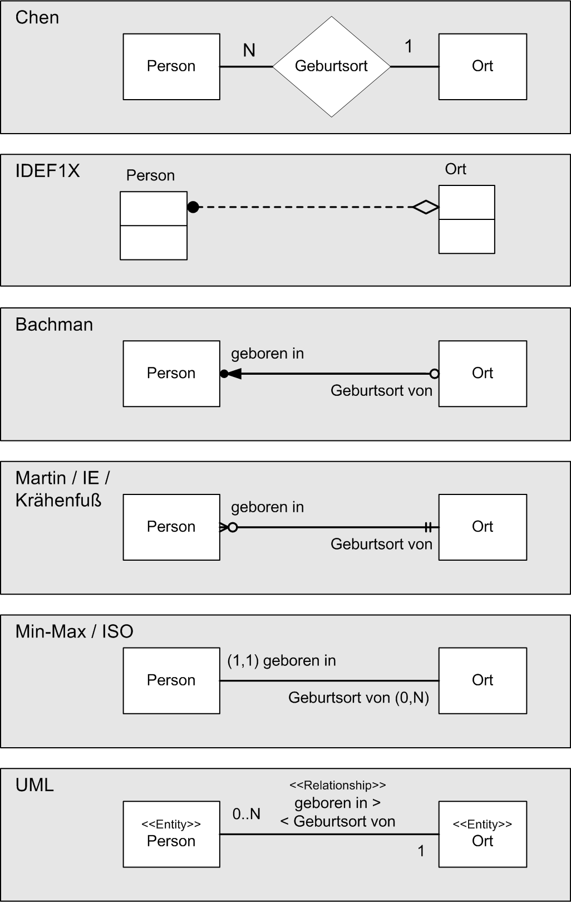

# Entity-Relationship-Modell

## Inhaltsverzeichnis

- [Grundlegende Komponenten](#grundlegende-komponenten)
- [Notationsformen](#notationsformen)

## Grundlegende Komponenten

- Entität (Entity): Typisierung gleichartiger Entitäten.
  - BSP: Angestellter
  - 
- Beziehung (Relationship): Verknüpfung / Zusammenhang zwischen zwei oder mehreren Entitäten.
  - BSP: Angestellter **leitet**
  - 
- Eigenschaft (attribute): Was über eine Entität (im Kontext) von Interesse ist. Diese Attribute Identifizieren.
  - BSP: Name des Angestellten
  - 

## Notationsformen

Die Elemente der Beziehungen können in verschiedene Notationsformen eingeteilt werden:

- Chen-Notation
- IDEF1X
- Bachman-Notation
- Martin-Notation/Krähenfuß
- (min, max)-Notation
- UML Standard

Die wichtigsten drei sind:

- Chen-Notation
- Martin-Notation/Krähenfuß
- UML Standard

In der Prüfung darf man sich die Notationsform aussuchen
