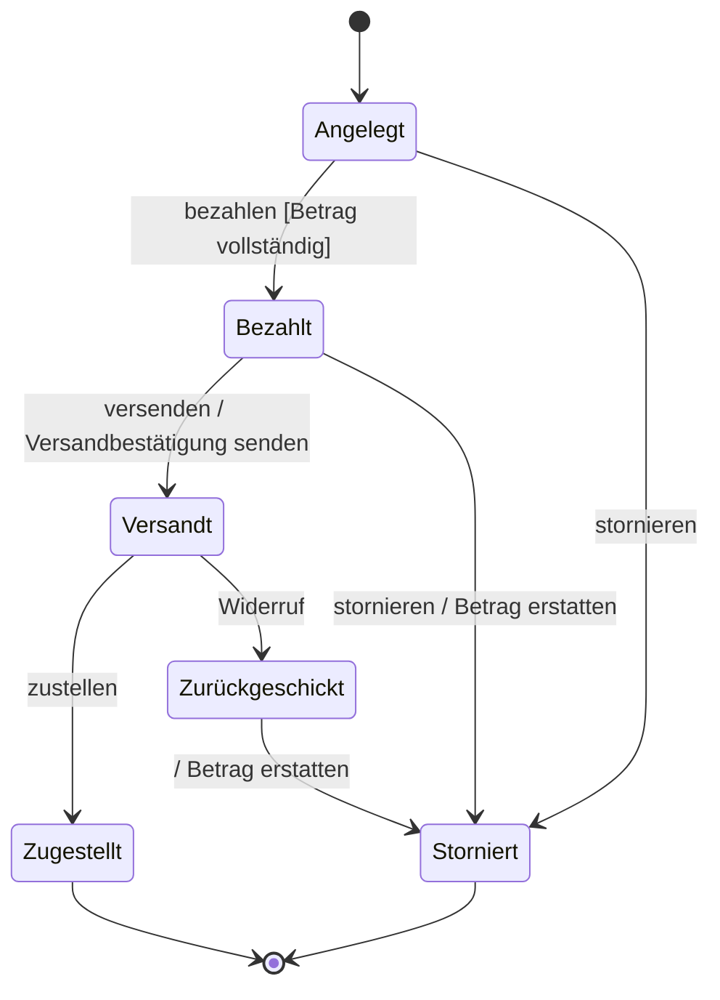

# Zustandsdiagramm

## Inhaltsverzeichnis

- [Wozu](#wozu)
- [Elemente](#elemente)
  - [Beschriftung einer Transition](#beschriftung-einer-transition)
  - [Aktivitäten innerhalb eines Zustands](#aktivitäten-innerhalb-eines-zustands)
- [Beispiel: eine Bestellung](#beispiel-eine-bestellung)
- [Worauf es in der Prüfung ankommt](#worauf-es-in-der-prüfung-ankommt)

## Wozu

[^1]
Ein Zustandsdiagramm (englisch *state machine diagram*) beschreibt, welche Zustände ein
einzelnes Objekt im Lauf seines Lebens annehmen kann und durch welche Ereignisse es von
einem in den nächsten wechselt.

Es beantwortet eine andere Frage als die übrigen UML-Diagramme:

| Diagramm | Frage |
|---|---|
| Klassendiagramm | Wie ist das System aufgebaut? |
| Anwendungsfalldiagramm | Was kann man damit tun? |
| Sequenzdiagramm | Wer redet in welcher Reihenfolge mit wem? |
| **Zustandsdiagramm** | **In welchen Zuständen kann ein Objekt sein, und was bringt es aus einem heraus?** |

Typische Kandidaten in Prüfungsaufgaben: eine Bestellung, ein Ausleihvorgang, ein Ticket
im Servicedesk, ein Automat.

## Elemente

| Element | Notation | Bedeutung |
|---|---|---|
| Startzustand | ausgefüllter Kreis | wo das Objekt entsteht; genau einer je Diagramm |
| Zustand | Rechteck mit runden Ecken | eine Lage, in der das Objekt auf etwas wartet |
| Transition | Pfeil | Wechsel von einem Zustand in einen anderen |
| Endzustand | Kreis mit ausgefülltem Kern | das Objekt hört auf zu existieren; auch mehrere möglich |
| Entscheidung | Raute | eine Transition verzweigt nach einer Bedingung |
| Zusammengesetzter Zustand | Rechteck um mehrere Zustände | fasst Teilzustände zusammen |

### Beschriftung einer Transition

```text
Ereignis [Bedingung] / Aktion
```

Alle drei Teile sind einzeln weglassbar:

- **Ereignis** — was von außen passiert, zum Beispiel `bezahlen`
- **Bedingung** (*Guard*) — muss wahr sein, damit die Transition feuert, zum Beispiel
  `[Betrag vollständig]`
- **Aktion** — was beim Wechsel ausgeführt wird, zum Beispiel `/ Rechnung erzeugen`

Feuert eine Transition ohne Ereignis, wechselt das Objekt automatisch, sobald es mit dem
Zustand fertig ist.

### Aktivitäten innerhalb eines Zustands

| Schlüsselwort | wann |
|---|---|
| `entry /` | einmal beim Betreten des Zustands |
| `do /` | fortlaufend, solange das Objekt im Zustand ist |
| `exit /` | einmal beim Verlassen |

## Beispiel: eine Bestellung



Zu lesen: eine Bestellung entsteht im Zustand *Angelegt*. Das Ereignis `bezahlen` bringt
sie nach *Bezahlt*, aber nur wenn der Betrag vollständig ist. Aus *Versandt* führen zwei
Wege heraus — welcher genommen wird, entscheidet das Ereignis, nicht das Diagramm.

## Worauf es in der Prüfung ankommt

- **Zustände sind Substantive oder Partizipien**, keine Tätigkeiten. *Bezahlt* ist ein
  Zustand, *Bezahlen* wäre eine Aktion und gehört an die Transition.
- **Genau ein Startzustand.** Endzustände dürfen mehrere sein — oder gar keiner, wenn das
  Objekt endlos läuft.
- **Jeder Zustand muss erreichbar sein**, und aus jedem Zustand außer dem Endzustand muss
  ein Weg herausführen. Ein Zustand ohne ausgehende Transition ist eine Sackgasse und
  fast immer ein Fehler in der Aufgabe.
- **Zwei Transitionen mit demselben Ereignis aus demselben Zustand** brauchen sich
  ausschließende Bedingungen. Sonst ist nicht bestimmt, welche feuert.
- Ein Zustandsdiagramm beschreibt **ein Objekt**, nicht das System. Wer Zustände
  verschiedener Objekte mischt, hat die Aufgabe missverstanden.

[^1]: <https://de.wikipedia.org/wiki/Zustandsdiagramm_(UML)>
