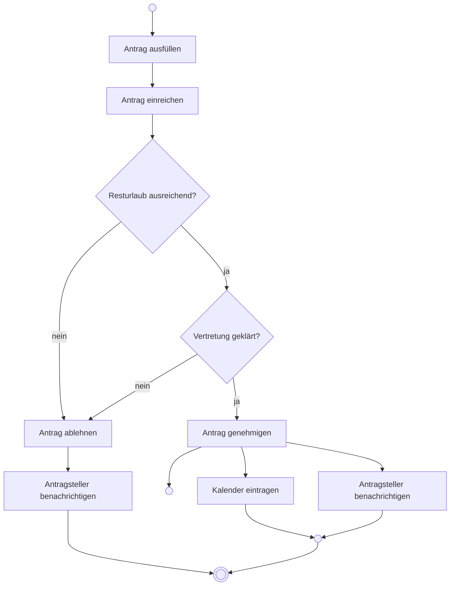

# Aktivitätsdiagramm

## Inhaltsverzeichnis

- [Wozu](#wozu)
- [Elemente](#elemente)
- [Beispiel: Urlaubsantrag](#beispiel-urlaubsantrag)
- [Aktivitätsbereiche (Swimlanes)](#aktivitätsbereiche-swimlanes)
- [Abgrenzung zu den Nachbarn](#abgrenzung-zu-den-nachbarn)
- [Worauf es in der Prüfung ankommt](#worauf-es-in-der-prüfung-ankommt)

## Wozu

[^1]
Ein Aktivitätsdiagramm beschreibt einen Ablauf: welche Schritte in welcher Reihenfolge
passieren, wo sich der Weg verzweigt und was gleichzeitig laufen darf.

Es ist damit das UML-Gegenstück zum [Programmablaufplan](01-programmablaufplan.md), kann
aber zwei Dinge, die der PAP nicht kann:

- **Nebenläufigkeit** — mehrere Schritte laufen parallel
- **Zuständigkeit** — Aktivitätsbereiche zeigen, wer welchen Schritt ausführt

Deshalb wird es sowohl für Programmlogik als auch für Geschäftsprozesse benutzt.

## Elemente

| Element | Notation | Bedeutung |
|---|---|---|
| Startknoten | ausgefüllter Kreis | Beginn des Ablaufs |
| Aktion | Rechteck mit runden Ecken | ein Arbeitsschritt |
| Kante | Pfeil | Reihenfolge |
| Entscheidungsknoten | Raute, ein Eingang | Verzweigung nach Bedingung |
| Verbindungsknoten | Raute, ein Ausgang | führt Zweige wieder zusammen |
| Gabelung (*Fork*) | dicker Balken, ein Eingang | ab hier läuft alles gleichzeitig |
| Vereinigung (*Join*) | dicker Balken, ein Ausgang | wartet, bis **alle** Zweige da sind |
| Endknoten | Kreis mit ausgefülltem Kern | Ablauf beendet |
| Ablaufende | Kreis mit Kreuz | nur dieser Zweig endet, der Rest läuft weiter |
| Aktivitätsbereich | senkrechte oder waagerechte Bahn | wer den Schritt ausführt |

Die Bedingungen an den Kanten einer Verzweigung stehen in eckigen Klammern:
`[Betrag > 1000]`.

## Beispiel: Urlaubsantrag

Nach der Genehmigung laufen *Kalender eintragen* und *Antragsteller benachrichtigen*
nebenläufig — sie hängen nicht voneinander ab. Der Ablauf ist erst zu Ende, wenn beide
fertig sind.

!!! note "Zur Darstellung"

    Mermaid kennt Gabelung und Vereinigung nicht als eigene Symbole; hier stehen dafür
    die leeren Knoten. **In der Prüfung werden sie als dicker waagerechter Balken
    gezeichnet** — ein Balken mit einem eingehenden und mehreren ausgehenden Pfeilen ist
    eine Gabelung, mit mehreren eingehenden und einem ausgehenden eine Vereinigung.

## Aktivitätsbereiche (Swimlanes)

Wenn die Aufgabe fragt, *wer* was tut, wird das Diagramm in Bahnen unterteilt — je Bahn
eine Rolle, eine Abteilung oder ein System. Jede Aktion steht in der Bahn dessen, der sie
ausführt. Eine Kante über eine Bahngrenze hinweg ist eine Übergabe.

| Mitarbeiter | Vorgesetzter | Personalabteilung |
|---|---|---|
| Antrag ausfüllen | | |
| Antrag einreichen → | prüfen und genehmigen → | eintragen |

## Abgrenzung zu den Nachbarn

| | Programmablaufplan | Aktivitätsdiagramm | Zustandsdiagramm |
|---|---|---|---|
| beschreibt | Algorithmus | Ablauf | Objektlebenszyklus |
| Knoten sind | Anweisungen | Aktionen | Zustände |
| Nebenläufigkeit | nein | ja | eingeschränkt |
| Zuständigkeiten | nein | ja (Bahnen) | nein |
| genormt in | DIN 66001 | UML | UML |

## Worauf es in der Prüfung ankommt

- **Aktionen sind Tätigkeiten**: „Rechnung prüfen", nicht „Rechnungsprüfung".
- **Aus einem Entscheidungsknoten führen mindestens zwei Kanten**, und ihre Bedingungen
  müssen sich ausschließen und zusammen alle Fälle abdecken. Ein `[sonst]` ist erlaubt.
- **Gabelung und Vereinigung gehören paarweise.** Was gegabelt wurde, wird wieder
  vereinigt — sonst ist unklar, wann der Ablauf zu Ende ist.
- **Eine Vereinigung wartet auf alle Zweige**, ein Verbindungsknoten (Raute) wartet auf
  keinen. Das ist der häufigste Fehler: eine Raute, wo ein Balken hingehört.

[^1]: <https://de.wikipedia.org/wiki/Aktivit%C3%A4tsdiagramm>
