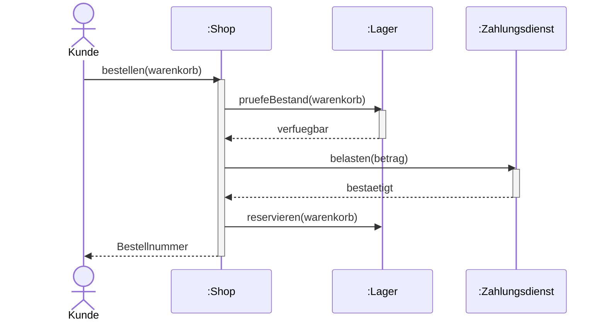
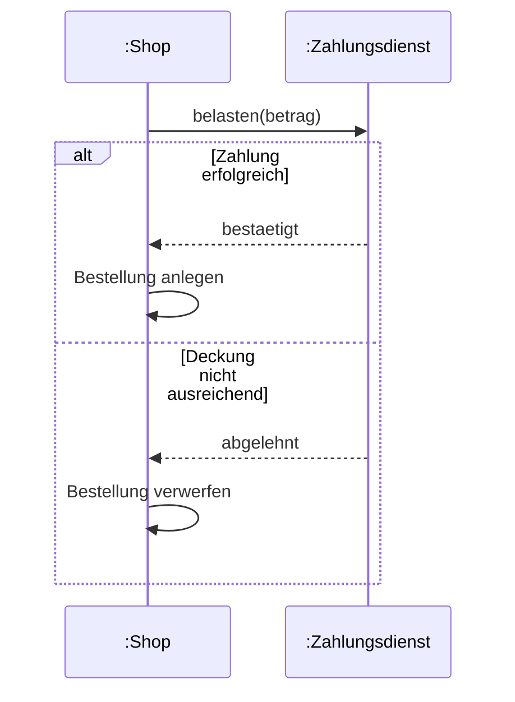

# Sequenzdiagramm

## Inhaltsverzeichnis

- [Wozu](#wozu)
- [Elemente](#elemente)
- [Beispiel: Bestellung aufgeben](#beispiel-bestellung-aufgeben)
- [Kombinierte Fragmente](#kombinierte-fragmente)
- [Abgrenzung](#abgrenzung)
- [Worauf es in der Prüfung ankommt](#worauf-es-in-der-prüfung-ankommt)

## Wozu

[^1]
Ein Sequenzdiagramm zeigt, welche Objekte in welcher **zeitlichen Reihenfolge** Nachrichten
austauschen. Die Zeit läuft von oben nach unten, die beteiligten Objekte stehen
nebeneinander am oberen Rand.

Es beschreibt immer **einen konkreten Ablauf**, nicht alle möglichen — typischerweise
einen Anwendungsfall aus dem [Anwendungsfalldiagramm](04-anwendungsfalldiagramm.md).

## Elemente

| Element | Notation | Bedeutung |
|---|---|---|
| Objekt | Rechteck oben, `name:Klasse` | Beteiligter am Ablauf |
| Lebenslinie | gestrichelte Senkrechte | die Zeit, in der das Objekt existiert |
| Aktivierungsbalken | schmales Rechteck auf der Linie | das Objekt arbeitet gerade |
| Synchrone Nachricht | durchgezogener Pfeil, ausgefüllte Spitze | Sender wartet auf die Antwort |
| Asynchrone Nachricht | durchgezogener Pfeil, offene Spitze | Sender wartet nicht |
| Antwort | gestrichelter Pfeil | Rückgabe an den Aufrufer |
| Erzeugung | Pfeil auf das Objektrechteck, `<<create>>` | Objekt entsteht mitten im Ablauf |
| Zerstörung | Kreuz am Ende der Lebenslinie, `<<destroy>>` | Objekt wird abgeräumt |

Die Beschriftung einer Nachricht ist der Aufruf, den sie auslöst: `pruefeBestand(artikelNr)`.

## Beispiel: Bestellung aufgeben

Zu lesen: der Kunde ruft `bestellen` auf und wartet. Der Shop fragt beim Lager nach,
belastet dann den Zahlungsdienst, reserviert die Ware und gibt erst danach die
Bestellnummer zurück.

## Kombinierte Fragmente

Verzweigungen und Wiederholungen stehen in einem Rahmen mit einem Schlüsselwort links
oben:

| Schlüsselwort | Bedeutung |
|---|---|
| `alt` | Alternative — mehrere Abschnitte, getrennt durch eine gestrichelte Linie; genau einer läuft |
| `opt` | Optional — der Abschnitt läuft nur, wenn die Bedingung gilt |
| `loop` | Wiederholung, oft mit Angabe wie `loop [1..n]` |
| `par` | Parallel — die Abschnitte laufen nebenläufig |
| `ref` | Verweis auf ein anderes Sequenzdiagramm |

## Abgrenzung

| | Sequenzdiagramm | Aktivitätsdiagramm |
|---|---|---|
| Schwerpunkt | wer mit wem, in welcher Reihenfolge | was passiert, in welcher Reihenfolge |
| Beteiligte | ausdrücklich als Lebenslinien | nur über Aktivitätsbereiche |
| Verzweigung | kombiniertes Fragment `alt` | Entscheidungsknoten |
| Zeitachse | senkrecht, ausdrücklich | ergibt sich aus den Kanten |

## Worauf es in der Prüfung ankommt

- **Reihenfolge ist die Senkrechte.** Eine Nachricht weiter oben passiert früher. Zwei
  Pfeile auf gleicher Höhe bedeuten nicht Gleichzeitigkeit — dafür gibt es `par`.
- **Objekte, keine Klassen.** Die Lebenslinie gehört zu `k1:Kunde`, nicht zu `Kunde`. Der
  Objektname darf fehlen (`:Kunde`), der Doppelpunkt nicht.
- **Zu jeder synchronen Nachricht gehört eine Antwort**, auch wenn sie nichts
  zurückgibt — sonst ist nicht erkennbar, wann der Aufrufer weiterläuft. Bei asynchronen
  Nachrichten fehlt die Antwort gerade absichtlich.
- **Ein Objekt darf sich selbst aufrufen.** Der Pfeil geht dann auf die eigene Lebenslinie
  zurück und erzeugt einen zweiten Aktivierungsbalken auf dem ersten.
- Wer ein Sequenzdiagramm aus einem Text ableiten soll, sucht die **Substantive** für die
  Objekte und die **Verben** für die Nachrichten.

[^1]: <https://de.wikipedia.org/wiki/Sequenzdiagramm>
