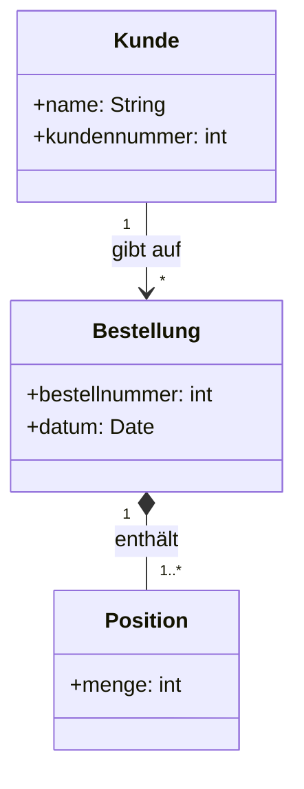
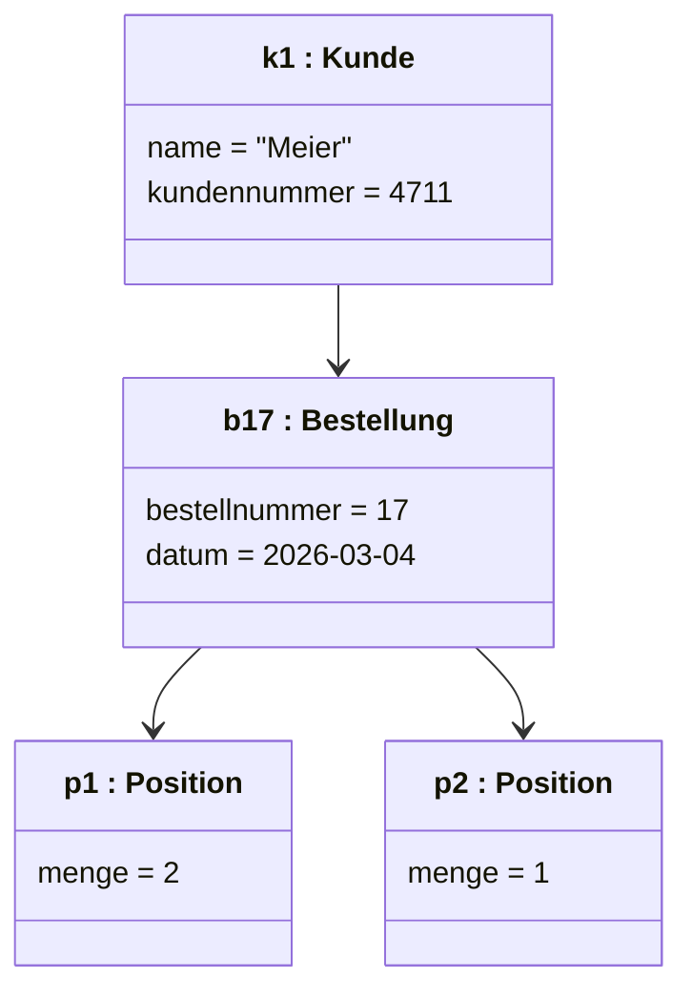

# Objektdiagramm

## Inhaltsverzeichnis

- [Wozu](#wozu)
- [Notation](#notation)
- [Beispiel](#beispiel)
- [Wann ein Objektdiagramm nicht zum Klassendiagramm passt](#wann-ein-objektdiagramm-nicht-zum-klassendiagramm-passt)
- [Worauf es in der Prüfung ankommt](#worauf-es-in-der-prüfung-ankommt)

## Wozu

[^1]
Ein Objektdiagramm zeigt eine **Momentaufnahme**: welche Objekte es zu einem bestimmten
Zeitpunkt gibt, welche Werte ihre Attribute haben und wie sie miteinander verbunden sind.

Es verhält sich zum [Klassendiagramm](03-klassendiagramm.md) wie ein Beispiel zu einer
Regel:

| Klassendiagramm | Objektdiagramm |
|---|---|
| Klasse `Kunde` | Objekt `k1:Kunde` |
| Attribut `name: String` | Wert `name = "Meier"` |
| Assoziation `Kunde 1 — * Bestellung` | Link zwischen `k1` und `b17` |
| gilt immer | gilt in genau diesem Moment |
| Multiplizität `1..*` | genau drei Objekte hängen dran |

In Prüfungsaufgaben taucht es meist in einer von zwei Formen auf: aus einem Klassendiagramm
ein gültiges Objektdiagramm ableiten, oder prüfen, ob ein gegebenes Objektdiagramm zum
Klassendiagramm passt.

## Notation

| Element | Notation |
|---|---|
| Objekt mit Name | `k1:Kunde` — **unterstrichen** |
| Objekt ohne Name (anonym) | `:Kunde` — der Doppelpunkt bleibt |
| Nur der Name, Klasse unbekannt | `k1` |
| Attributwerte | im unteren Fach, `name = "Meier"` |
| Link | Linie zwischen zwei Objekten, ohne Multiplizität |

Der **Unterstrich** unterscheidet ein Objekt von einer Klasse. Er ist das Merkmal, an dem
in der Prüfung erkannt wird, ob jemand den Unterschied verstanden hat.

Ein Objekt hat **keine Multiplizitäten** und **keine Methoden** — es hat Werte. Methoden
stehen in der Klasse.

## Beispiel

Klassendiagramm (die Regel):

Objektdiagramm (ein Moment):

Kunde `k1` hat genau eine Bestellung, und diese Bestellung hat zwei Positionen. Das ist
mit der Multiplizität `1..*` verträglich — mit `2..*` wäre es das ebenfalls, mit `3..*`
nicht mehr.

!!! note "Zur Darstellung"

    Mermaid kennt kein eigenes Objektdiagramm; die Objekte sind hier als Klassen mit
    Instanznamen gezeichnet. **In der Prüfung wird der Objektname unterstrichen**
    (<u>k1 : Kunde</u>) — das ist der eigentliche Unterschied zum Klassendiagramm und
    wird bewertet.

## Wann ein Objektdiagramm nicht zum Klassendiagramm passt

Die üblichen Fehler, nach denen in Aufgaben gefragt wird:

- **Multiplizität verletzt** — eine Bestellung ohne Position, obwohl `1..*` gefordert ist
- **Link ohne Assoziation** — zwei Objekte sind verbunden, deren Klassen im
  Klassendiagramm nichts miteinander zu tun haben
- **Attribut fehlt oder ist zu viel** — ein Objekt hat einen Wert, den seine Klasse gar
  nicht kennt
- **Falscher Typ** — `menge = "zwei"`, wo `int` steht
- **Komposition mehrfach belegt** — ein Teil hängt an zwei Ganzen, obwohl eine Komposition
  genau ein Ganzes erlaubt

## Worauf es in der Prüfung ankommt

- **Objektname unterstreichen.** Ohne Unterstrich ist es ein Klassendiagramm.
- **Der Doppelpunkt bleibt auch beim anonymen Objekt**: `:Kunde`, nicht `Kunde`.
- **An Links stehen keine Multiplizitäten.** Die Anzahl ergibt sich daraus, wie viele
  Objekte tatsächlich gezeichnet sind.
- **Konkrete Werte, keine Typen.** `name = "Meier"` statt `name: String`.
- Ein Objektdiagramm zeigt einen einzigen Zeitpunkt. Wer einen Ablauf zeigen will, braucht
  ein [Sequenzdiagramm](08-sequenzdiagramm.md) oder ein
  [Zustandsdiagramm](06-zustandsdiagramm.md).

[^1]: <https://de.wikipedia.org/wiki/Objektdiagramm>
