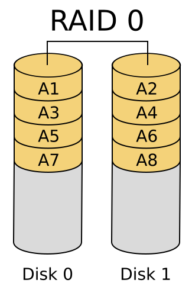
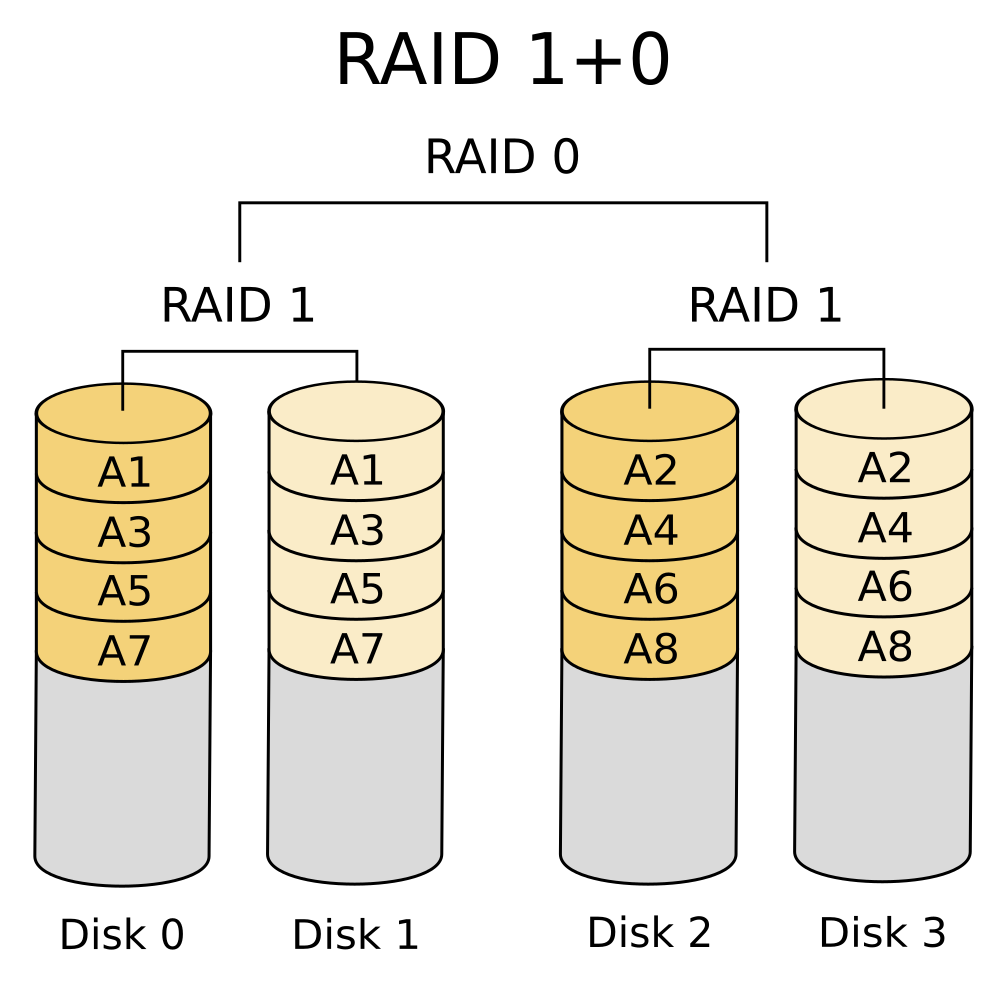
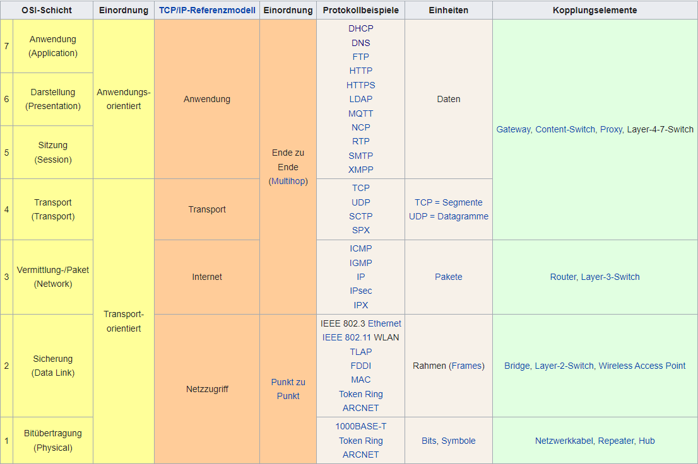

# Network technology

## Table of contents

- [Software and hardware RAID](#software-and-hardware-raid)
  - [Advantages of hardware RAID](#advantages-of-hardware-raid)
  - [Disadvantages of hardware RAID](#disadvantages-of-hardware-raid)
  - [Advantages of software RAID](#advantages-of-software-raid)
  - [Disadvantages of software RAID](#disadvantages-of-software-raid)
  - [Host RAID](#host-raid)
  - [RAID levels](#raid-levels)
    - [RAID 0: striping — speed without redundancy](#raid-0-striping--speed-without-redundancy)
      - [Advantages of RAID 0](#advantages-of-raid-0)
      - [Disadvantages of RAID 0](#disadvantages-of-raid-0)
      - [Use of RAID 0](#use-of-raid-0)
    - [RAID 1: mirroring](#raid-1-mirroring)
      - [Advantages of RAID 1](#advantages-of-raid-1)
      - [Disadvantages of RAID 1](#disadvantages-of-raid-1)
      - [Use of RAID 1](#use-of-raid-1)
    - [RAID 5: performance plus parity, block-level striping with distributed parity](#raid-5-performance-plus-parity-block-level-striping-with-distributed-parity)
      - [Advantages of RAID 5](#advantages-of-raid-5)
      - [Disadvantages of RAID 5](#disadvantages-of-raid-5)
      - [Use of RAID 5](#use-of-raid-5)
    - [RAID 01: nested RAID (RAID 1 across several RAID 0)](#raid-01-nested-raid-raid-1-across-several-raid-0)
    - [RAID 10: nested RAID (RAID 0 across several RAID 1)](#raid-10-nested-raid-raid-0-across-several-raid-1)
- [Storage systems](#storage-systems)
  - [SAN (storage area network)](#san-storage-area-network)
  - [NAS (network attached storage)](#nas-network-attached-storage)
- [Ethernet and MAC addresses](#ethernet-and-mac-addresses)
  - [Ethernet frame (in order, left to right)](#ethernet-frame-in-order-left-to-right)
  - [MAC addresses](#mac-addresses)
    - [Syntax](#syntax)
  - [IPv4](#ipv4)
    - [Address format](#address-format)
    - [Private IP addresses](#private-ip-addresses)
      - [Address ranges](#address-ranges)
    - [How it works](#how-it-works)
- [LAN (local area network)](#lan-local-area-network)
- [WLAN (wireless local area network)](#wlan-wireless-local-area-network)
- [DHCP](#dhcp)
  - [Concept](#concept)
  - [DHCP server](#dhcp-server)
    - [Static allocation](#static-allocation)
      - [Advantage of static allocation](#advantage-of-static-allocation)
      - [Disadvantage of static allocation](#disadvantage-of-static-allocation)
    - [Automatic allocation](#automatic-allocation)
      - [Advantage of automatic allocation](#advantage-of-automatic-allocation)
      - [Disadvantage of automatic allocation](#disadvantage-of-automatic-allocation)
    - [Dynamic allocation](#dynamic-allocation)
  - [DHCP messages](#dhcp-messages)
  - [What a DHCP server can assign to a client](#what-a-dhcp-server-can-assign-to-a-client)
  - [Where it is used](#where-it-is-used)
- [Firewall](#firewall)
- [VPN (virtual private network)](#vpn-virtual-private-network)
  - [Properties of a VPN](#properties-of-a-vpn)
  - [The OSI layer a VPN is realised on](#the-osi-layer-a-vpn-is-realised-on)
  - [Where a VPN is used](#where-a-vpn-is-used)
  - [Is a VPN secure? No. What makes a VPN tunnel secure?](#is-a-vpn-secure-no-what-makes-a-vpn-tunnel-secure)
- [The OSI model](#the-osi-model)

## Software and hardware RAID

[^1]

### Advantages of hardware RAID

- Data access on hardware RAIDs is usually faster
- The controller manages the disks independently of the host computer and consumes none of its processing power
- Replacing a failed disk is simple

### Disadvantages of hardware RAID

- More expensive than software RAID
- Compatibility problems with some operating systems
- Performance problems can occur with other technologies such as SSDs

### Advantages of software RAID

- Cheaper than hardware RAID, because no controller is needed
- The (software) controller manages the disks as part of the host system
- Software RAIDs can be implemented in an operating system and used across several devices

### Disadvantages of software RAID

- Data access can be slower than with hardware RAID
- Attached devices have to be compatible with the operating system
- Replacing a disk takes more effort, because the software has to be told to switch the RAID controller off first

### Host RAID

Host RAID sits between hardware and software RAID. It uses chipsets on the mainboard, or
inexpensive RAID adapters. Mainboards with a RAID function usually only handle RAID 0 and
1; more expensive variants may add RAID 5. It is called host RAID because the RAID
functions are carried out by the firmware or the drivers.

### RAID levels

[^2]

#### RAID 0: striping — speed without redundancy

The zero in RAID 0 stands for zero data redundancy. Strictly speaking RAID 0 is therefore
not a RAID system at all, but rather a fast array of independent disks. Two or more disks
are combined into one large logical drive. The data is usually divided into blocks of 64
or 128 kB (stripes), which is where the name striping comes from.

With RAID 0 it is advisable to use disks of equal size, because the total capacity of the
array is the size of the smallest disk multiplied by the number of disks.

##### Advantages of RAID 0

- Higher throughput, because disk accesses run in parallel to a greater degree
- This only holds for sequential data transfer

##### Disadvantages of RAID 0

- If one disk fails the data is useless, because only half of every stored file is still readable
- If part of a file is missing, the rest cannot be reconstructed, so RAID 0 provides no data protection at all
- The probability of failure rises with each additional disk: the array is lost as soon as **one** disk fails. With two disks a failure is therefore about twice as likely as with a single one
- Unsuitable for classic server operation

##### Use of RAID 0

- When very large amounts of data have to be read in a short time and data safety is irrelevant
- For temporary files, such as the Windows page file or the Linux swap area

RAID 0: 

#### RAID 1: mirroring

RAID 1 is an array of two disks holding identical data (mirroring), which gives full
redundancy. The disks have to come in pairs, and the capacity is again determined by the
smallest one. On writing, the array is only as fast as its slowest disk.

##### Advantages of RAID 1

- If one disk fails, work continues without data loss and with only a small loss of speed
- This gives high reliability and data safety
- When reading, a RAID 1 system can access more than one disk and read different sectors from different disks at the same time, which raises read performance

##### Disadvantages of RAID 1

- No real increase in throughput
- It is not a backup: an accidental or faulty write operation is applied to every disk
- The setup is expensive, because twice the price buys single capacity
- Two 500 GB disks add up to 1 TB, but since RAID 1 mirrors the data only half of that is usable

##### Use of RAID 1

- Rather for small servers, since large amounts of data are better stored with higher RAID levels

RAID 1: 

#### RAID 5: performance plus parity, block-level striping with distributed parity

As with RAID 0 the data is split into blocks (stripe sets). In addition, an area on every
disk is used for parity, so that errors can be corrected afterwards. The parity is
computed bitwise with an XOR operation: two 64 kB data blocks produce the parity
information, a third 64 kB block. This kind of RAID needs three disks.

Unlike RAID 4, RAID 5 distributes the parity bits and the data across all three disks.

##### Advantages of RAID 5

- Higher throughput
- Data safety
- Comparatively low cost (still, at least three disks are needed)
- If one disk fails, the data can be reconstructed during operation from the parity information

##### Disadvantages of RAID 5

- No more than one disk may fail, otherwise the data is lost
- Write speed is lower, because before every write the parity information has to be read and recalculated
- Loss of capacity through storing parity. With three disks of 500 GB you get 1.5 TB − 500 GB = 1 TB of storage

##### Use of RAID 5

- For large amounts of data in small files, because of the lower write speed

RAID 5: 

#### RAID 01: nested RAID (RAID 1 across several RAID 0)

RAID 01 combines RAID 0 and RAID 1, that is striping and mirroring. At least four disks
are required. The data is first split into blocks (stripe sets) and striped across two
disks to form a RAID 0; two such RAID 0 arrays are then mirrored. This combines safety
with higher throughput.

RAID 01: 

#### RAID 10: nested RAID (RAID 0 across several RAID 1)

RAID 10 combines RAID 1 and RAID 0. At least four disks are required. The RAID controller
mirrors the data first, producing two RAID 1 pairs, which are then combined into one
RAID 0. This raises both data safety (higher than with RAID 01) and throughput.

RAID 10 is particularly suited to storing larger amounts of data redundantly.

RAID 10: 

---

## Storage systems

### SAN (storage area network)

- A SAN is network storage that several clients can access

### NAS (network attached storage)

- A NAS is a storage device on the local network; authorised devices can put data on it over that network

---

## Ethernet and MAC addresses

### Ethernet frame (in order, left to right)

[^3]

- Preamble: 7 bytes
- Start frame delimiter (SFD): 1 byte
- Destination address (DA): 6 bytes [MAC]
- Source address (SA): 6 bytes [MAC]
- Type/length: 2 bytes
- Payload: 46 – 1,500 bytes
- Frame check sequence: 4 bytes

### MAC addresses

[^4] 
A MAC address (media access control address) is a unique identifier assigned to a network
interface controller (NIC). A MAC address is 48 bits long. It is also called the physical
address, because it is partly programmed into the device by the manufacturer and cannot be
changed.

#### Syntax

On Ethernet networks the MAC address consists of 48 bits, or six bytes. It is written in
hexadecimal, usually byte by byte with the individual bytes separated by hyphens or
colons:

- `00-80-41-ae-fd-7e`
- `008041-aefd7e`, or
- `00:80:41:ae:fd:7e`

### IPv4

[^5] 
IP addresses can be written in decimal, binary, octal and hexadecimal, with or without
dots.

IPv4 uses 32-bit addresses. They are usually written in decimal as four blocks, for
example 207.142.131.235. A block must not start with a zero. Each octet represents 8 bits,
so the range per block is 0 to 255.

#### Address format

An IP address consists of a network part and a host part. The network part identifies a
subnet, the host part identifies a device within that subnet.

Example:

||decimal|||binary||
|---|---|---|---|---|---|
|IP address|192.168.0|.23| -> |11000000.10101000.00000000 |.00010111|
|Subnet mask|255.255.255|.0| -> |11111111.11111111.11111111|.00000000|
||network part|host part||network part|host part|

The subnet mask determines exactly where the network part ends and the host part begins.
With a mask of `255.255.255.0` the address would be written `192.168.0.23/24` in CIDR
notation, where the 24 means that the first 24 bits of the mask are set to 1. The bits set
to 1 mark the positions of the address that belong to the network part; the remaining
positions, set to 0, form the host part.

Remember that `192.168.0.0` and `192.168.0.255` are reserved: 
`192.168.0.0` is the network itself 
`192.168.0.255` is the broadcast address 

#### Private IP addresses

Private IP addresses belong to particular ranges that are not routed on the internet.
Anyone may use them inside a private network such as a LAN. The following ranges were set
aside from the public address space for private use.

##### Address ranges

- Network address ranges:
  - 10.0.0.0 to 10.255.255.255
  - 172.16.0.0 to 172.31.255.255
  - 192.168.0.0 to 192.168.255.255
- Network classes:
  - Class A -> 1 private network with 16,777,216 addresses (10.0.0.0/8)
  - Class B -> 16 private networks with 65,536 addresses each (172.16.0.0/16 to 172.31.0.0/16)
  - Class C -> 256 private networks with 256 addresses each (192.168.0.0/24 to 192.168.255.0/24)
- Number of addresses:
  - 2²⁴ = 16,777,216
  - 2²⁰ = 1,048,576
  - 2¹⁶ = 65,536

This avoids pointless administrative overhead when maintaining local networks.

#### How it works

- Computers on a network that have been given private IP addresses form an intranet and can only talk to each other
- The intranet cannot be reached from the internet
- Internet routers ignore the private address ranges
- To provide internet access, a gateway or router has to be placed in the private network that holds both a private and a public IP address
- The private range in use is only ever visible inside its own private network, so the same addresses can be handed out in other private networks as well

---
 

## LAN (local area network)

[^6]
A LAN is a computer network limited to a relatively small geographical area such as an
office building, a school or a campus. It allows computers, devices and resources to be
networked within that limited area.

Devices such as computers, laptops, printers, servers, network switches and routers can be
connected on a LAN. The connection is normally made over an Ethernet cable or a wireless
link such as Wi-Fi.

A LAN works with internal IP addresses that cannot be seen from outside the network. These
addresses are found in every private network and can be assigned freely — see
[private IP addresses](#private-ip-addresses).

## WLAN (wireless local area network)

[^7]
A WLAN is a wireless network technology that lets devices communicate without a physical
cable connection. It is based on the IEEE 802.11 standard and uses radio waves to transmit
data between devices.

## DHCP

[^10] 
The Dynamic Host Configuration Protocol (DHCP) is a communication protocol. It lets a
server hand clients the right network configuration. DHCP is an extension of the bootstrap
protocol (BOOTP).

The fixed part of a DHCP packet is 236 bytes long, followed by the options. The header
fields are aligned to 32 bits, which is where the widespread but wrong claim that a DHCP
packet is 32 bits long comes from.

DHCP is defined in RFC 2131 and 2132.

### Concept

DHCP lets clients join an existing network without configuring the network interface by
hand. Information such as the IP address, subnet mask, gateway and name server (DNS), as
well as further settings, is assigned automatically.

### DHCP server

Like all common network services, the DHCP server runs as a background process (service or
daemon) and listens on UDP port 67 for requests from clients. The client receives the
replies on UDP port 68.

A DHCP server has three modes of operation:

#### Static allocation

In this mode IP addresses are tied to a particular MAC address. The addresses are assigned
to those MAC addresses indefinitely.

##### Advantage of static allocation

Static allocation helps when network services have to be reachable at a known address.
Port forwardings from a router to a client also normally require a fixed IP address.

##### Disadvantage of static allocation

No further clients can join the network once every address has been assigned permanently.
Under some security considerations that is a problem in itself.

#### Automatic allocation

With automatic allocation, ranges of IP addresses are defined on the DHCP server. New
clients receive addresses that are then bound to their MAC address and recorded in a table.
Unlike dynamic allocation, automatically assigned addresses stay assigned and are not
released.

##### Advantage of automatic allocation

An IP address always belongs to the same host and cannot be handed to another one.

##### Disadvantage of automatic allocation

New clients receive no address once the whole range has been handed out, even if some of
those addresses are no longer in use.

#### Dynamic allocation

Dynamic allocation works like automatic allocation, except that the configuration also
sets how long a given IP address may stay with a client. When that time is up, the client
contacts the server and asks for an extension. If it does not, the address becomes free
and can be handed to another client — or to the same one again. This period is called the
lease time.

Some configurations tie addresses to the MAC address, so that even after a long absence a
client can get its old address back, as long as it has not been reassigned in the meantime.

### DHCP messages

- DHCP**DISCOVER**:
  - A client without an IP address sends a broadcast asking every DHCP server on the local network for an address offer.
- DHCP**OFFER**:
  - The DHCP servers answer a DHCP**DISCOVER** with the values they can offer.
- DHCP**REQUEST**:
  - The client asks one of the answering servers for one of the offered addresses, for further data, and for an extension of the lease.
- DHCP**ACK**:
  - The server confirms a DHCP**REQUEST**.
- DHCP**NAK**:
  - The server rejects a DHCP**REQUEST**.
- DHCP**DECLINE**:
  - The client rejects the offer because the address is already in use.
- DHCP**RELEASE**:
  - The client gives up its configuration so that the parameters become available to other clients again.
- DHCP**INFORM**:
  - A client asks for further configuration parameters, for example because it uses a static IP address.

### What a DHCP server can assign to a client

- IP address
- Subnet mask
- Default gateway
- Name server
- Proxy configuration via WPAD
- Time and NTP server
- DNS server, DNS context and DNS tree
- Secondary DNS server
- WINS server (for Microsoft Windows clients)

### Where it is used

- Large networks that change frequently
- Ordinary users who simply want a network connection without having to know much about network configuration

---
 

## Firewall

- Security problems a firewall does **not** protect against
- Filtering technologies
  - Packet filter
  - Stateful packet inspection
  - Proxy filter
  - Content filter
- Types of firewall
  - Personal firewall (desktop firewall)
  - External firewall (network or hardware firewall)
- Firewall technologies
  - Packet filter firewall
  - Stateful inspection firewall (SIF)
  - Firewall router
  - Application layer firewall
  - Proxy firewall (application layer firewall)

---
 

## VPN (virtual private network)

VPNs are point-to-point connections across a private or a public network, for example the
internet. The connections are provided by a public ISP (internet service provider). For
transmission across the internet a tunnel is created. To place a virtual call to a virtual
port on a VPN server, special TCP/IP-based protocols are used, so-called tunnelling
protocols.

### Properties of a VPN

- High flexibility
- Low transmission cost
- Encapsulation
- Pure software product

### The OSI layer a VPN is realised on

- VPN tunnelling can be realised on OSI layer 2 or OSI layer 3.
  - OSI layer 2 (data link layer)
    - Layer 2 tunnelling is represented by PPTP (Point-to-Point Tunneling Protocol), L2F (Layer 2 Forwarding) and L2TP (Layer 2 Tunneling Protocol)
  - OSI layer 3 (network layer)
    - IPsec

### Where a VPN is used

- Remote access
- Connecting networks
- Connecting computers across an intranet to form closed groups
- Company networks

### Is a VPN secure? No. What makes a VPN tunnel secure?

- Identification
- Authentication
- Encryption of the data, to protect it from unauthorised parties
- Firewall
- Use of tunnelling protocols:
  - PPTP
  - L2TP
  - IPsec
  - SSTP

## The OSI model

[^11] 

| # | Layer | Task | Unit | Devices and protocols |
|---|---|---|---|---|
| 7 | Application layer | Interface to the application | Data | HTTP, FTP, SMTP, DNS |
| 6 | Presentation layer | Character set, encryption, compression | Data | TLS, ASCII, JPEG |
| 5 | Session layer | Setting up and tearing down sessions, synchronisation | Data | NetBIOS, RPC |
| 4 | Transport layer | End-to-end connection, port numbers | Segment | TCP, UDP |
| 3 | Network layer | Routing between networks, logical addresses | Packet | IP, ICMP, router |
| 2 | Data link layer | Error detection, physical addresses | Frame | Ethernet, MAC, switch, bridge |
| 1 | Physical layer | Signals on the medium | Bit | Cable, hub, repeater |

Mnemonic, read from layer 1 upwards: *Please Do Not Throw Sausage Pizza Away* — physical,
data link, network, transport, session, presentation, application.

What the exam usually wants to know: which layer does a given device work on? Hub and
repeater on 1, switch and bridge on 2, router on 3. Depending on its design a firewall can
work on 3, 4 or 7.

 

[^1]: <https://www.techtarget.com/searchstorage/tip/Key-differences-in-software-RAID-vs-hardware-RAID>
[^2]: <https://en.wikipedia.org/wiki/RAID>
[^3]: <https://en.wikipedia.org/wiki/Ethernet_frame>
[^4]: <https://en.wikipedia.org/wiki/MAC_address>
[^5]: <https://en.wikipedia.org/wiki/IPv4>
[^6]: <https://en.wikipedia.org/wiki/Local_area_network>
[^7]: <https://en.wikipedia.org/wiki/Wireless_LAN>
[^10]: <https://en.wikipedia.org/wiki/Dynamic_Host_Configuration_Protocol>
[^11]: <https://en.wikipedia.org/wiki/OSI_model>
