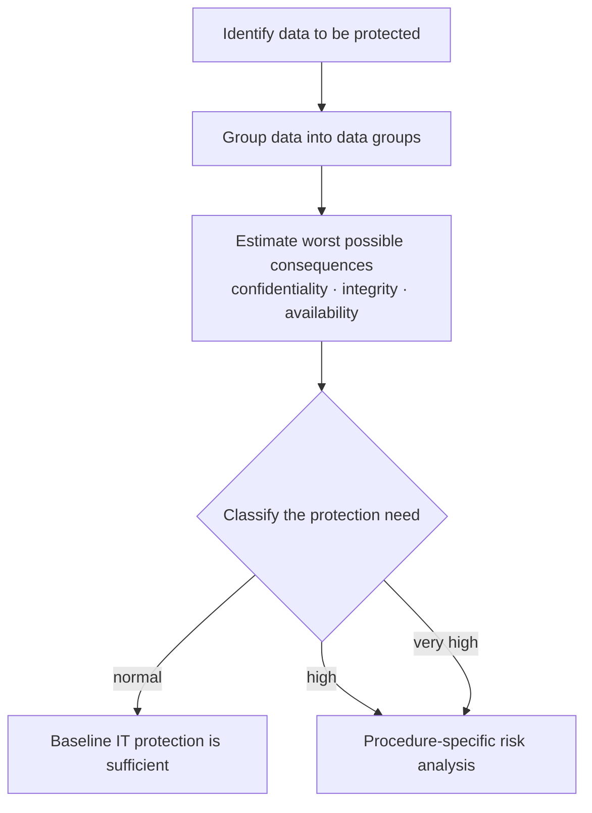

# IT protection and security

## Table of contents

- [Data Protection](#data-protection)
  - [Art. 32 of the GDPR - Security and Processing](#art-32-of-the-gdpr---security-and-processing)
  - [3 Aspects of IT Security](#3-aspects-of-it-security)
  - [Authentication, verification, authorization](#authentication-verification-authorization)
  - [ISMS (Information Security Management System)](#isms-information-security-management-system)
- [Protection Needs Analysis](#protection-needs-analysis)
  - [Identification of Data to be Protected](#identification-of-data-to-be-protected)
  - [Summarizing Data into Data Groups](#summarizing-data-into-data-groups)
  - [Determining the Worst Possible Consequences of Loss](#determining-the-worst-possible-consequences-of-loss)
  - [Classification into a Protection Category](#classification-into-a-protection-category)
  - [Violation of Laws, Regulations, and Contracts](#violation-of-laws-regulations-and-contracts)
    - [Data Protection Laws](#data-protection-laws)
    - [Co-Determination Regulations](#co-determination-regulations)
    - [Contracts](#contracts)
- [Symmetric Encryption](#symmetric-encryption)
  - [Methods](#methods)
  - [Advantages of symmetric encryption](#advantages-of-symmetric-encryption)
  - [Disadvantages of symmetric encryption](#disadvantages-of-symmetric-encryption)
- [Asymmetric Encryption](#asymmetric-encryption)
  - [Advantages of asymmetric encryption](#advantages-of-asymmetric-encryption)
  - [Disadvantages of asymmetric encryption](#disadvantages-of-asymmetric-encryption)
- [2FA - Two-Factor Authentication](#2fa---two-factor-authentication)
  - [Examples of 2FA](#examples-of-2fa)
  - [Authenticating (the user proves who they are)](#authenticating-the-user-proves-who-they-are)
  - [Verifying (the service checks the proof)](#verifying-the-service-checks-the-proof)
  - [Authorizing](#authorizing)
  - [Types of Authentication](#types-of-authentication)
    - [Knowledge](#knowledge)
      - [Examples of Authentication by Knowledge](#examples-of-authentication-by-knowledge)
    - [Possession](#possession)
      - [Examples of Authentication by Possession](#examples-of-authentication-by-possession)
    - [Physical Characteristics / Biometrics](#physical-characteristics--biometrics)
      - [Examples of Authentication by Biometrics](#examples-of-authentication-by-biometrics)
- [Attacks and countermeasures](#attacks-and-countermeasures)
  - [Man-in-the-middle](#man-in-the-middle)
  - [SQL injection](#sql-injection)
  - [Cross-site scripting](#cross-site-scripting)
  - [Cross-site request forgery](#cross-site-request-forgery)
  - [Denial of service and DDoS](#denial-of-service-and-ddos)
  - [Social engineering and phishing](#social-engineering-and-phishing)
  - [The attacks at a glance](#the-attacks-at-a-glance)
- [Kerberos](#kerberos)
- [The legal framework since 2024](#the-legal-framework-since-2024)
  - [The NIS 2 implementation act](#the-nis-2-implementation-act)
  - [The EU regulation on artificial intelligence](#the-eu-regulation-on-artificial-intelligence)

## Data Protection

- GDPR - General Data Protection Regulation
- BDSG - Federal Data Protection Act

### Art. 32 of the GDPR - Security and Processing

[^1]

1. Pseudonymization and encryption of personal data
2. the ability to ensure the ongoing confidentiality, integrity, availability and resilience of processing systems and services
3. the ability to restore the availability of and access to personal data in a timely manner in the event of a physical or technical incident
4. a process for regularly testing, assessing and evaluating the effectiveness of technical and organizational measures for ensuring the security of processing

In addition, compliance and assessment of these requirements must take into account the risks associated with processing.

### 3 Aspects of IT Security

- Confidentiality
- Integrity
- Availability

### Authentication, verification, authorization

[^2]

- Authentication = Verification of the provided data
- Authorization = When information is correct, the other party grants access

### ISMS (Information Security Management System)

[^3]
The establishment of procedures and rules within an organization aimed at defining, controlling, monitoring, maintaining and continually improving information security.

<br>

## Protection Needs Analysis

[^4] [^5]
Protection needs analysis evaluates the appropriateness of data protection based on the information technology used and the information processed. The value of data and functions is typically many times higher than the value of IT devices themselves. Therefore, appropriate security measures must be derived from the security requirements of IT procedures.

<br>



*The steps of a protection needs analysis. Source of the original diagram:
[FU Berlin](https://tetfolio.fu-berlin.de/web/ii_555094:9).*

<br>

The protection need is determined by estimating the worst possible consequences of the loss of **confidentiality**, **integrity**, and **availability**. The assessment must be carried out separately for the following six categories of damage:

- Impairment of the right to informational self-determination
- Impairment of personal integrity
- Impairment of task fulfillment
- Negative external impact
- Financial implications
- Violation of laws, regulations, and contracts

<br>

For each application and the processed information, the potential damages and their categorization into "normal," "high," or "very high" classes are considered. If the result of the protection needs analysis classifies the chosen IT procedure into the "normal" class, the measures of basic IT protection are sufficient. In all other cases, a procedure-specific risk analysis must be carried out.

<br>

**The following steps are applied in the protection needs analysis:**

1. Identification of data to be protected
2. Summarizing data into data groups (optional)
3. Determining the worst possible consequences
4. Classification into a protection category

<br>

### Identification of Data to be Protected

The first step is to identify all data processed or stored within the analyzed IT procedure.
> **Example:** First name, last name, street, house number, postal code, city, research results, patent application

<br>

### Summarizing Data into Data Groups

Often, multiple individual data can be grouped together based on content. Subsequent steps should then be applied to these data groups rather than the individual data they contain.
>**Example:**  
Contact details
(first name, last name, street, house number, postal code, city)<br>
Research results<br>
Patent application

<br>

### Determining the Worst Possible Consequences of Loss

Each data group is evaluated with regard to the six mentioned categories of damage. For each of the six damage categories, it is considered what consequences the impairment of the protection goals **confidentiality**, **integrity**, and **availability** would have in the worst case.

<br>

>Example Confidentiality:<br>
**Incident:** Unauthorized individuals gain knowledge of personnel data.<br>
**Consequences:** Interaction with colleagues may be impaired.

<br>

>Example Integrity:<br>
**Incident:** Research data is altered unauthorizedly.<br>
**Consequences:** There is likely to be a loss of regional reputation.

<br>

>Example Availability:<br>
**Incident:** Personnel data is unavailable.<br>
**Consequences:** Delays in salary payments occur.

<br>

### Classification into a Protection Category

The worst consequences determined in the estimation considerations must be classified into the categories in the assessment table.

**Here's an example of classification for the loss of confidentiality in a table:**

<table cellspacing="2" cellpadding="2">
  <tbody>
    <tr>
      <td colspan="1" rowspan="2"><b>Damage Categories</b></td>
      <td colspan="1" rowspan="2">Threat</td>
      <td colspan="3" rowspan="1">Damage Estimation&nbsp;</td>
    </tr>
    <tr>
      <td>normal</td>
      <td>high</td>
      <td>very high</td>
    </tr>
    <tr>
      <td>
        Impairment of the right to informational self-determination
      </td>
      <td>Disclosure of data to unauthorized parties</td>
      <td>X</td>
      <td><br></td>
      <td><br></td>
    </tr>
    <tr>
      <td>Impairment of personal integrity</td>
      <td>Abuse of data…</td>
      <td>X</td>
      <td><br></td>
      <td><br></td>
    </tr>
    <tr>
      <td>Impairment of task fulfillment</td>
      <td>Disclosure of data to unauthorized parties…</td>
      <td>X</td>
      <td><br></td>
      <td><br></td>
    </tr>
    <tr>
      <td>Negative external impact</td>
      <td>Abuse of data…</td>
      <td><br></td>
      <td>X</td>
      <td><br></td>
    </tr>
    <tr>
      <td>Financial implications</td>
      <td>Abuse of data…</td>
      <td>X</td>
      <td><br></td>
      <td><br></td>
    </tr>
    <tr>
      <td colspan="2" rowspan="1">
        <strong>resulting protection needs:</strong>
      </td>
      <td colspan="3" rowspan="1"><strong>high</strong></td>
    </tr>
  </tbody>
</table>

<br>

### Violation of Laws, Regulations, and Contracts

All regulations relevant to the respective IT procedure must be considered here.

<br>

#### Data Protection Laws
>
>**Example:**<br>
Information Processing Act (IVG)<br>
Federal Data Protection Act (BDSG)<br>
General Data Protection Regulation (GDPR)

<br>

#### Co-Determination Regulations
>
>**Example:** IT basic service agreement

<br>

#### Contracts
>
>**Example:** Contract for cooperation with an external company

<br>

## Symmetric Encryption

In Symmetric Encryption, both parties use the same key, which is responsible for both encryption and decryption.

### Methods

- AES
- DES
- Triple-DES
- IDEA
- Blowfish
- QUISCI
- Twofish

These methods are very fast even for large amounts of data.

### Advantages of symmetric encryption

- Simple key management since only one key is needed for encryption and decryption.
- High speed for encryption and decryption.

### Disadvantages of symmetric encryption

- Only one key for encryption and decryption, key must not fall into unauthorized hands.
- Key must be transmitted securely.
- Number of keys grows quadratically with the number of participants.

## Asymmetric Encryption

Asymmetric Encryption is also known as Public-Key Encryption. Here, there are not only one but two keys, this so-called key pair consists of a private key and a public key. With the private key, data is decrypted or a digital signature is generated. With the public key, data can be encrypted and generated signatures can be verified for their authenticity. This method is very slow and therefore only suitable for small amounts of data.

### Advantages of asymmetric encryption

- Relatively high security.
- Not as many keys needed as with symmetric encryption methods, thus less effort in keeping the key secret.
- No key distribution problem, as public key is accessible to everyone without issues.
- Possibility of authentication through electronic signatures (digital signatures).

### Disadvantages of asymmetric encryption

- Works very slowly, approximately 10,000 times slower than symmetric encryption.
- Large required key length.
- Problems with multiple recipients of an encrypted message, as the message has to be encrypted separately each time.
- Security risk due to the public key accessible to everyone -> Man in the Middle.

## 2FA - Two-Factor Authentication

[^6]
Two-Factor Authentication, also known as 2FA, refers to the identity verification of a user using a combination of two different and particularly independent components.

### Examples of 2FA

- Bank card + PIN
- Fingerprint
- Access cards
- TAN in online banking

### Authenticating (the user proves who they are)

The general "signing in" to a user's service is called authentication.
The user must authenticate themselves with the service.

### Verifying (the service checks the proof)

[^7]
Once the user has authenticated and the check has been successfully completed, the service or server can authenticate the user successfully.

### Authorizing

Once the user has been successfully authenticated and authorized, permissions can be distributed, which is called authorization.
The same system can also be applied to buildings or similar.

### Types of Authentication

[^8]
Authentication can be achieved through several methods.

#### Knowledge

Characteristics:

- Can be forgotten
- Can be duplicated, distributed, passed on, or betrayed
- Can potentially be guessed

##### Examples of Authentication by Knowledge

- Password
- PIN
- Security question

#### Possession

Characteristics:

- Creation of a feature incurs comparatively high costs.
- Management of the possession is insecure and involves effort (must be carried)
- Can be lost
- Can be stolen
- Can be handed over, passed on, duplicated
- Can be replaced

##### Examples of Authentication by Possession

- Chip card
- Magnetic stripe card
- RFID card/chip
- Physical key
- Key codes on a hard drive
- SIM card in the mTAN procedure
- Certificate e.g. in SSL
- TAN
- One Time PIN
- USB stick with password safe

#### Physical Characteristics / Biometrics

Characteristics:

- Always carried by individuals
- Cannot be passed on to other individuals
- Requires special equipment for recognition
- Subject to change over time or due to accidents
- Cannot be replaced
- May raise privacy concerns

##### Examples of Authentication by Biometrics

- Fingerprint
- Face recognition
- Typing behavior
- Voice recognition
- Iris recognition (eyes)
- Retinal features (eye background)
- Handwriting (signature)
- Hand geometry (hand scanner)
- Palm vein pattern
- Genetic information (DNA)

## Attacks and countermeasures

Since 2025 the examination catalogue names man-in-the-middle, SQL injection and DDoS explicitly. They are collected here together with the other attacks that regularly appear in tasks. For web applications, the OWASP Top Ten serve as the wider reference.[^9]

### Man-in-the-middle

The attacker inserts themselves into the connection between two parties and pretends to each of them to be the other. They can read and alter traffic without either side noticing.[^10]

Typical routes in are a fake wireless access point, ARP spoofing on the local network, or a manipulated DNS record.

Countermeasures: end-to-end encryption with TLS, checking the certificate against a trusted authority, HSTS, certificate pinning. What matters is not the encryption alone but the **authenticity of the other end** — an encrypted connection to the attacker is worth nothing.

### SQL injection

User input reaches an SQL statement unchecked and changes its structure. A query looking up a user name becomes a query that returns every record, or drops a table.[^11]

```sql
-- Vulnerable: the input is pasted into the text of the statement
SELECT * FROM users WHERE name = 'INPUT';

-- Input: ' OR '1'='1
SELECT * FROM users WHERE name = '' OR '1'='1';
```

Countermeasures, in this order:

1. **Prepared statements with placeholders.** The database server knows the structure of the statement before it sees the data — input can no longer change it.
2. Validate input against an allow-list, not against a list of forbidden characters.
3. Give the application a database account with as few privileges as possible.
4. Never pass database error messages through to the user.

Escaping special characters alone is not enough — that is the most common wrong answer to this question.

### Cross-site scripting

The attacker gets foreign script code into a page that other users open. The script then runs in the victim's browser with the privileges of the attacked site and can, for instance, read the session cookie.[^12]

A distinction is drawn between the stored variant — the code sits permanently in the database, in a comment for example — and the reflected one, where it arrives in the response through a prepared link.

Countermeasures: escape output according to its context, set a content security policy, mark session cookies `HttpOnly`.

### Cross-site request forgery

The victim is logged in to an application and opens another site on the side. That site sends a request to the application in their name — the browser attaches the valid session cookie automatically.[^13]

Countermeasures: a random token per form that the server recognises, the `SameSite` attribute on the session cookie, and POST rather than GET for anything that changes state.

### Denial of service and DDoS

A service is flooded with requests until legitimate users can no longer reach it. The protection goal under attack is **availability**.[^14]

In the distributed form (DDoS) the requests come from many compromised machines at once and can therefore no longer be blocked by a single address. Amplification is common on top of that: the attacker sends small requests with a forged sender address to third-party services whose large answers then land on the victim.

Countermeasures: rate limiting, filtering at the network provider, delivery through a distributed network, and an incident plan with named contacts for the real thing.

### Social engineering and phishing

This attack does not target the technology but the person: a forged message from management, a supposed call from the IT department, a visitor with a parcel and a friendly smile.[^15]

The countermeasures are correspondingly organisational: training, a fixed call-back procedure for payment instructions, the four-eyes principle — and technically, two-factor authentication, which renders a stolen password useless on its own.

### The attacks at a glance

| Attack | Protection goal violated | Main countermeasure |
|---|---|---|
| Man-in-the-middle | confidentiality, integrity | TLS with a verified certificate |
| SQL injection | all three | prepared statements |
| Cross-site scripting | confidentiality, integrity | escape output, CSP |
| Cross-site request forgery | integrity | form token, `SameSite` |
| DDoS | availability | rate limiting, filtering at the provider |
| Social engineering | all three | training, two-factor authentication |

## Kerberos

Kerberos is a network protocol for authentication over insecure networks and has been in the examination catalogue since 2025. It is the basis of logging in to a Windows domain.[^16]

At its core is a trusted third party, the **key distribution centre**, made up of an authentication service and a ticket-granting service.

1. The user authenticates once to the authentication service and receives a **ticket-granting ticket**.
2. With that ticket they request a ticket for a particular service from the ticket-granting service.
3. They present that service ticket to the service, which verifies it without asking the KDC.

Two properties matter for the examination. The **password is never sent across the network** — it is only used to decrypt the KDC's answer. And tickets are time-limited, which is why the clocks of all parties have to agree; a difference of a few minutes makes the login fail.

The benefit is a single sign-on for many services, the drawback is the central dependency: if the KDC is down, nobody logs in.

## The legal framework since 2024

Two bodies of rules came into force after the last major revision of this collection and bear directly on IT security.

### The NIS 2 implementation act

The German act implementing the European NIS 2 directive was promulgated on 6 December 2025 and has applied since, without a transition period. Around 29,500 companies are affected — far more than before, because it no longer covers operators of critical infrastructure only but entities above certain size thresholds across eighteen sectors.[^17]

The obligations sit in § 30 BSIG: risk management across ten named areas, among them supply chain security, incident handling, cryptography and multi-factor authentication.[^18] On top of that come registration with the federal office and a staged duty to report significant incidents:

| Deadline | What has to be reported |
|---|---|
| 24 hours | first notification of whether a significant incident has occurred |
| 72 hours | assessment with severity and impact |
| 1 month | final report with cause and countermeasures |

New as well is the personal responsibility of the management: it has to approve and supervise the measures and undergo training itself.

### The EU regulation on artificial intelligence

The AI Act entered into force on 1 August 2024 and applies in stages. Prohibited practices and the duty of AI literacy have applied since 2 February 2025, the rules for general-purpose models since 2 August 2025, and the bulk of the regulation from 2 August 2026.[^19]

It follows a risk-based approach with four levels:

| Level | Examples | Consequence |
|---|---|---|
| **Unacceptable risk** | social scoring of people, emotion recognition at the workplace | prohibited |
| **High risk** | shortlisting applicants, creditworthiness, medical devices | extensive obligations, conformity assessment |
| **Limited risk** | chatbots, generated images and texts | transparency: make it recognisable that AI is involved |
| **Minimal risk** | spam filters, recommendations in a shopping basket | no particular obligations |

Article 4 is the one that matters for apprenticeships: anyone operating or providing AI systems has to ensure that the staff dealing with them have sufficient AI literacy. That has applied since February 2025 and does not depend on company size.

[^1]: <https://gdpr-info.eu/art-32-gdpr/>
[^2]: <https://www.protonmail.com/blog/what-is-authentication-authorization-accountability/>
[^3]: <https://en.wikipedia.org/wiki/Information_security_management_system>
[^4]: <https://en.wikipedia.org/wiki/IT_baseline_protection#Determination_of_protection_requirements>
[^5]: <https://tetfolio.fu-berlin.de/web/ii_555094:9>
[^6]: <https://en.wikipedia.org/wiki/Multi-factor_authentication>
[^7]: <https://en.wikipedia.org/wiki/Authentication>
[^8]: <https://en.wikipedia.org/wiki/Authentication#Methods>
[^9]: <https://owasp.org/www-project-top-ten/>
[^10]: <https://en.wikipedia.org/wiki/Man-in-the-middle_attack>
[^11]: <https://en.wikipedia.org/wiki/SQL_injection>
[^12]: <https://en.wikipedia.org/wiki/Cross-site_scripting>
[^13]: <https://en.wikipedia.org/wiki/Cross-site_request_forgery>
[^14]: <https://en.wikipedia.org/wiki/Denial-of-service_attack>
[^15]: <https://en.wikipedia.org/wiki/Social_engineering_(security)>
[^16]: <https://en.wikipedia.org/wiki/Kerberos_(protocol)>
[^17]: <https://www.bsi.bund.de/dok/nis-2>
[^18]: <https://www.gesetze-im-internet.de/bsig_2025/__30.html>
[^19]: <https://digital-strategy.ec.europa.eu/en/policies/regulatory-framework-ai>
