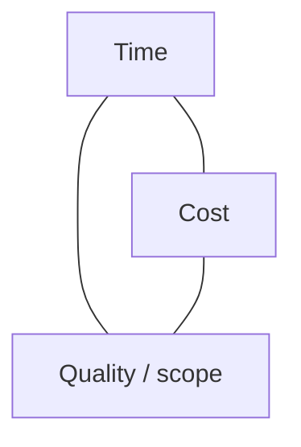
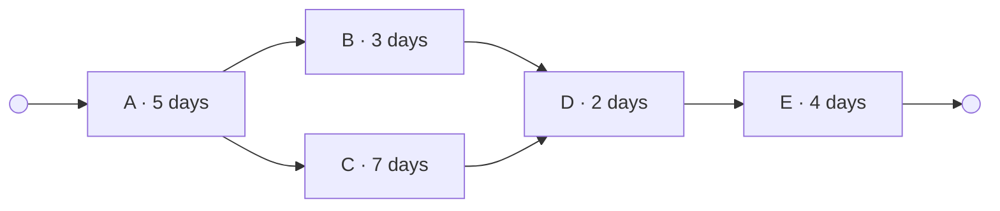

# Project management

## Table of contents

- [Management Areas](#management-areas)
- [The Project Management Triangle](#the-project-management-triangle)
- [Approaches](#approaches)
  - [Conventional (Sequential) Approach](#conventional-sequential-approach)
  - [Agile (Flexible) Approach](#agile-flexible-approach)
  - [Development Method](#development-method)
  - [Development Philosophy](#development-philosophy)
- [Network Diagram](#network-diagram)
  - [Main Function of the Network Diagram](#main-function-of-the-network-diagram)
  - [Elements of a Network Diagram](#elements-of-a-network-diagram)
- [Gantt Chart](#gantt-chart)

## Management Areas

- Quality Management
- Communication Management
- Risk Management
- Integration Management
- Scope Management
- Schedule Management
- Cost Management
- Human Resource Management
- Procurement Management

## The Project Management Triangle

*The project management triangle: the three quantities depend on each other. Changing
one of them inevitably changes at least one of the other two.*

[^1]

By definition according to DIN ISO 69901, a project is characterized by the following seven criteria:

- Uniqueness of the project
- Concrete objectives (cost, schedule: defined start and end point, resources)
- Temporal, financial, and personnel limitations
- Interdisciplinary nature of the tasks and team
- Complexity
- Unusualness
- Novelty

## Approaches

### Conventional (Sequential) Approach

- Waterfall Model
- V-Model
- Spiral Model
- Capability Maturity Model (CMM)

### Agile (Flexible) Approach

- Scrum
- Kanban

### Development Method

- Extreme Programming (XP)
- Test-Driven Development (TDD)
- Model-Driven Software Development

### Development Philosophy

- Agile Unified Process (AUP)

## Network Diagram

[^2]
DIN 69 900 describes the methods for scheduling and planning in project management, defines network diagrams as graphical or tabular representations of a sequence of activities consisting of events and relationships.

### Main Function of the Network Diagram

A network diagram forms the basis for scheduling and has the following functions:

- It helps determine the total duration of a project.
- It establishes the temporal and logical sequence of activities in a project.
- It visualizes the critical path and thus the activities that can endanger the planned project end.
- It represents possible buffers or reserves in the schedule.

*The critical path is A → C → D → E, taking 18 days. Activity B has three days of
float: it may slip by three days without endangering the project end date.*

[^2]

### Elements of a Network Diagram

A network diagram is a tool from graph theory that consists of nodes and arrows. It has three essential elements:

- An activity is an action with an earliest and latest start and finish time.
- An event is a defined, describable state in the project process.
- An precedence relationship defines the logical - i.e., technical, and personnel - and the temporal dependency between individual activities; it always exists between exactly two nodes.

| | | |
|---|---|---|
| **ES** earliest start | **D** duration | **EF** earliest finish |
| **No.** activity number | **Activity name** | |
| **LS** latest start | **TF** total float · **FF** free float | **LF** latest finish |

Calculation rules:

- Forward pass: `EF = ES + D`; the ES of an activity is the largest EF of its predecessors
- Backward pass: `LS = LF - D`; the LF of an activity is the smallest LS of its successors
- `TF = LS - ES`; an activity with `TF = 0` lies on the critical path

## Gantt Chart

[^1]: <https://www.crossgo.com/de/produkt/projektmanagement>
[^2]: <https://t2informatik.de/wissen-kompakt/netzplan/>
