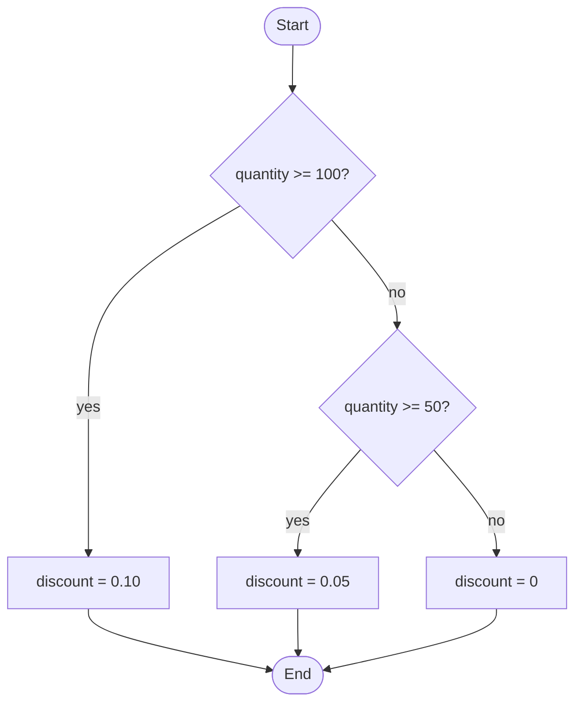

# Algorithms

The examination area "Developing and implementing algorithms" asks for four things: reading program code and writing a solution in a programming language, transferring algorithms into program logic and representing them graphically, selecting test scenarios and generating test data, and writing queries to retrieve and manipulate data.[^1] The examination takes 90 minutes and counts for 10 per cent.

The last point is SQL and lives in the [Databases](03-databases.md) chapter. This chapter covers the rest.

## Table of contents

- [Pseudocode](#pseudocode)
  - [What pseudocode is](#what-pseudocode-is)
  - [Conventions for pseudocode](#conventions-for-pseudocode)
  - [What the marking looks at](#what-the-marking-looks-at)
- [The building blocks](#the-building-blocks)
  - [Sequence](#sequence)
  - [Selection](#selection)
  - [Iteration](#iteration)
  - [Recursion](#recursion)
- [Estimating running time](#estimating-running-time)
- [Search algorithms](#search-algorithms)
  - [Linear search](#linear-search)
  - [Binary search](#binary-search)
- [Sorting algorithms](#sorting-algorithms)
  - [Bubble sort](#bubble-sort)
  - [Selection sort](#selection-sort)
  - [Insertion sort](#insertion-sort)
  - [The three methods compared](#the-three-methods-compared)

## Pseudocode

Since the 2025 examination catalogue, flowcharts and Nassi-Shneiderman diagrams are no longer part of the examination. Where a Nassi-Shneiderman diagram used to be enough, pseudocode or an [activity diagram](diagrams/07-activity-diagram.md) is now expected — and a pseudocode task can no longer be sidestepped by drawing a diagram instead.[^2]

### What pseudocode is

Pseudocode is program code without the constraints of a particular language.[^3] It is neither compiled nor executed; it is meant to be read. The examination catalogue requires the solution to be readable by a third party who does not know the programming language used.

### Conventions for pseudocode

There is no binding standard for pseudocode — neither in general nor for the German chamber examinations. There is, however, an approach that always works: use a language you know well and drop everything that only the compiler needs.

| Drop | Keep |
|---|---|
| curly braces | indentation that shows the block structure |
| semicolons | one statement per line |
| data types and declarations | meaningful variable names |
| `import`, `using`, namespaces | the actual flow |
| class scaffolding and entry method | the function or method being asked for |

Java code such as

```java
public int calculateAge(int year, int month, int birthYear, int birthMonth) {
    int age = year - birthYear;
    if (month < birthMonth) {
        age--;
    }
    return age;
}
```

becomes

```text
calculateAge(year, month, birthYear, birthMonth)
    age = year - birthYear
    if month < birthMonth
        age = age - 1
    return age
```

### What the marking looks at

Syntax errors do no harm as long as the flow stays recognisable. What is marked is the logic: are all cases covered? Are the termination conditions right? Are edge cases handled — empty input, a single element, division by zero?

Most marks are lost not to syntax but to a loop that stops one iteration too early or too late.

## The building blocks

Every algorithm can be assembled from three building blocks — sequence, selection and iteration. That is not an exam mnemonic but a theorem of computer science: the Böhm-Jacopini theorem.

### Sequence

Statements run in the order in which they are written.

```text
read price
tax = price * 0.19
output price + tax
```

### Selection

A condition decides which of several branches is executed.

```text
if quantity >= 100
    discount = 0.10
else if quantity >= 50
    discount = 0.05
else
    discount = 0
```



The order of the conditions is part of the logic: put `quantity >= 50` first and nobody ever gets the ten per cent.

### Iteration

A loop runs a block more than once. Three forms are distinguished:

| Form | Condition checked | Runs at least | Typical use |
|---|---|---|---|
| pre-test (`while`) | before the iteration | zero times | number of iterations unknown |
| post-test (`do-while`, `repeat … until`) | after the iteration | once | input that has to happen at least once |
| counting loop (`for`) | before the iteration | zero times | number of iterations known |

A counting loop is a special case of the pre-test loop with a counter, a start value, an end value and a step width.

### Recursion

A function calls itself with a smaller sub-problem. Every recursion needs a **base case**, otherwise the call stack overflows.

```text
factorial(n)
    if n <= 1
        return 1
    return n * factorial(n - 1)
```

Every recursion can also be written iteratively and vice versa. Recursive is usually shorter, iterative is easier on memory.

## Estimating running time

Big O notation describes how the effort of an algorithm grows with the input size *n*.[^4] Constant factors and lower-order terms drop out: 3*n*² + 5*n* + 12 becomes O(*n*²).

| Class | Name | Example | Steps at n = 1,000 |
|---|---|---|---|
| O(1) | constant | accessing an array element by index | 1 |
| O(log n) | logarithmic | binary search | about 10 |
| O(n) | linear | linear search | 1,000 |
| O(n log n) | linearithmic | merge sort, quicksort on average | about 10,000 |
| O(n²) | quadratic | bubble sort, selection sort | 1,000,000 |
| O(2ⁿ) | exponential | exhaustive enumeration | not computable in practice |

The right-hand column is why the question of complexity is not theory: between O(n log n) and O(n²) there is a factor of a hundred at a thousand elements, and a factor of fifty thousand at a million.

Rule of thumb for reading it off unfamiliar code: one loop over all elements is O(n), a loop inside a loop is O(n²), halving the search space each step is O(log n).

## Search algorithms

### Linear search

Each element is compared with the search value in turn, until it is found or the array ends.

```text
linearSearch(array, wanted)
    for i from 0 to length(array) - 1
        if array[i] == wanted
            return i
    return -1
```

Effort O(n). The method requires nothing — in particular, the array does not have to be sorted.

### Binary search

Requires a **sorted** array. The middle element is compared; depending on the result, the search continues in the left or the right half only.[^5]

```text
binarySearch(array, wanted)
    left = 0
    right = length(array) - 1
    while left <= right
        middle = (left + right) / 2        rounded down
        if array[middle] == wanted
            return middle
        if array[middle] < wanted
            left = middle + 1
        else
            right = middle - 1
    return -1
```

Effort O(log n): 1,000 elements need at most 10 comparisons, a million at most 20.

Two traps that examination tasks like to build in. First the termination condition `left <= right` — with `<`, the last remaining element is never checked. Second `middle + 1` and `middle - 1` when narrowing the range; assigning `middle` instead gives an endless loop.

## Sorting algorithms

The three elementary methods have been named explicitly in the examination catalogue since 2025.[^2] All three run in O(n²) on average and are unsuitable for large amounts of data — they are examined because loop logic can be followed through on them.[^6]

The array `[5, 2, 9, 1]` serves as the running example.

### Bubble sort

Adjacent elements are compared and swapped when they are in the wrong order. After each pass the largest remaining element sits at the end — it rises like a bubble.[^7]

```text
bubbleSort(array)
    for i from 0 to length(array) - 2
        for j from 0 to length(array) - 2 - i
            if array[j] > array[j + 1]
                swap array[j] and array[j + 1]
```

| Pass | Array afterwards | Note |
|---|---|---|
| Start | 5, 2, 9, 1 | |
| 1 | 2, 5, 1, 9 | 9 is in its final place |
| 2 | 2, 1, 5, 9 | 5 is in its final place |
| 3 | 1, 2, 5, 9 | done |

The inner counter runs one field less far with each pass, because the tail is already sorted. Forgetting the `- i` still produces the right result, only with pointless comparisons. A flag recording whether anything was swapped during a pass allows an early exit; with input that is already sorted, the effort then drops to O(n).

### Selection sort

Each pass looks for the smallest element of the unsorted remainder and swaps it to the front of that remainder.[^8]

```text
selectionSort(array)
    for i from 0 to length(array) - 2
        smallest = i
        for j from i + 1 to length(array) - 1
            if array[j] < array[smallest]
                smallest = j
        swap array[i] and array[smallest]
```

| Pass | Array afterwards | Note |
|---|---|---|
| Start | 5, 2, 9, 1 | |
| 1 | 1, 2, 9, 5 | smallest is 1, swaps with position 0 |
| 2 | 1, 2, 9, 5 | 2 is already in the right place |
| 3 | 1, 2, 5, 9 | done |

Selection sort swaps at most *n* − 1 times and therefore far less often than bubble sort. The number of **comparisons**, however, stays the same regardless — even for input that is already sorted.

### Insertion sort

The array is split into a sorted front part and an unsorted tail. The next element is inserted into the front part at the right position — the way playing cards are sorted in the hand.[^9]

```text
insertionSort(array)
    for i from 1 to length(array) - 1
        current = array[i]
        j = i - 1
        while j >= 0 and array[j] > current
            array[j + 1] = array[j]
            j = j - 1
        array[j + 1] = current
```

| Pass | Array afterwards | Note |
|---|---|---|
| Start | 5, 2, 9, 1 | 5 counts as sorted |
| 1 | 2, 5, 9, 1 | 2 inserted before 5 |
| 2 | 2, 5, 9, 1 | 9 stays where it is |
| 3 | 1, 2, 5, 9 | 1 moved to the front |

Insertion sort is the fastest of the three on nearly sorted data: the inner loop exits immediately and the effort approaches O(n).

### The three methods compared

| | Bubble sort | Selection sort | Insertion sort |
|---|---|---|---|
| Best case | O(n) with early exit | O(n²) | O(n) |
| Average and worst case | O(n²) | O(n²) | O(n²) |
| Additional memory | O(1) | O(1) | O(1) |
| Number of swaps | high | low, at most n − 1 | medium |
| Stable | yes | no | yes |

**Stable** means that elements with the same sort key keep their original order relative to each other. That matters as soon as several criteria are sorted for one after another.

None of the three is used in practice. Standard libraries sort with O(n log n) methods — quicksort, merge sort, or hybrids of them such as Timsort.

[^1]: <https://www.gesetze-im-internet.de/fiausbv/__14.html>
[^2]: <https://it-berufe-podcast.de/neuer-pruefungskatalog-fuer-die-ap2-als-fachinformatiker-anwendungsentwicklung-ab-2025-it-berufe-podcast-191/>
[^3]: <https://en.wikipedia.org/wiki/Pseudocode>
[^4]: <https://en.wikipedia.org/wiki/Big_O_notation>
[^5]: <https://en.wikipedia.org/wiki/Binary_search>
[^6]: <https://en.wikipedia.org/wiki/Sorting_algorithm>
[^7]: <https://en.wikipedia.org/wiki/Bubble_sort>
[^8]: <https://en.wikipedia.org/wiki/Selection_sort>
[^9]: <https://en.wikipedia.org/wiki/Insertion_sort>
