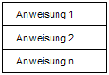
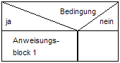
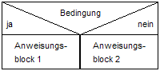
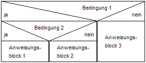
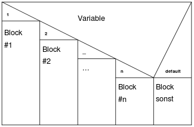

# Nassi-Shneiderman diagram (structogram)

> **Apparently no longer required for the AP2.** According to a public walkthrough of the 2025 examination catalogue, the Nassi-Shneiderman diagram has been removed from it; pseudocode and the [activity diagram](07-activity-diagram.md) take its place. Where that statement comes from, and how far it can be relied on, is set out in [The final examination at a glance](../00-exam.md); the replacement is in [Algorithms](../10-algorithms.md). The notation stays here because it still appears in vocational school and shows nesting particularly well.

## Table of contents

- [Nassi-Shneiderman / Structogram](#nassi-shneiderman--structogram)
  - [Explanation](#explanation)
  - [Diagram Blocks](#diagram-blocks)
    - [Process Symbol](#process-symbol)
    - [Decision Symbol](#decision-symbol)
      - [1. Possible Block](#1-possible-block)
      - [2. Possible Block](#2-possible-block)
      - [Example Nesting](#example-nesting)
      - [Case-Statement](#case-statement)
    - [Loops](#loops)
      - [Iteration Symbol](#iteration-symbol)

## Nassi-Shneiderman / Structogram

[^1]

### Explanation

A Nassi-Shneiderman diagram is a diagram type used to represent program designs within the method of Structured Programming.

Since Nassi-Shneiderman diagrams represent program structures and control structures, they are also referred to as **Structograms**.

### Diagram Blocks

Most of the following structure blocks can be nested within each other. The structogram composed of different structure blocks is rectangular as a whole, just as wide as its widest structure block.

#### Process Symbol

- Each instruction is written in a rectangular structure block.
- The structure blocks are traversed one after the other from top to bottom.
- Empty structure blocks are only allowed in branches.
- Alternative terms: Sequence, Command sequence, Instruction sequence, Instruction block, Linear sequence, Sequence.

#### Decision Symbol

Alternative terms: Branching, Alternative, Selection

##### 1. Possible Block

- Only if the condition is true, the instruction block 1 is executed `(if)`. If the condition is not true, the execution continues without further instruction (exit at the bottom).
- Alternative terms: Conditional processing, Simple selection, Simple branching.

##### 2. Possible Block

- If the condition is true, the first instruction block is executed. If the condition is not true, the second instruction block is executed. `(if else)`
- Alternative terms: Simple alternative, Dual selection, Alternative branching/processing.

##### Example Nesting

- Nesting is possible in both the yes and no cases.

##### Case-Statement

- The value of **Variable** can be conditionally checked for equality as well as for ranges (greater/less for numbers). The corresponding applicable "case" with its associated instruction block is executed (`switch`, `select`).
- Alternative terms: Multiple alternatives, Case selection, Multiple selection, Case, Select.

#### Loops

##### Iteration Symbol

[^1]: <https://en.wikipedia.org/wiki/Nassi-Shneiderman_diagram>
