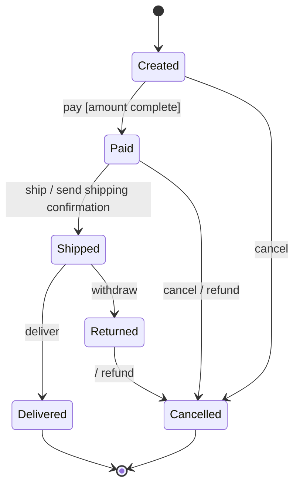

# State diagram

## Table of contents

- [What it is for](#what-it-is-for)
- [Elements](#elements)
  - [Labelling a transition](#labelling-a-transition)
  - [Activities inside a state](#activities-inside-a-state)
- [Example: an order](#example-an-order)
- [What the exam is looking for](#what-the-exam-is-looking-for)

## What it is for

[^1]
A state machine diagram describes which states a **single object** can be in over its
lifetime, and which events move it from one state to the next.

It answers a different question from the other UML diagrams:

| Diagram | Question |
|---|---|
| Class diagram | How is the system built? |
| Use case diagram | What can you do with it? |
| Sequence diagram | Who talks to whom, in what order? |
| **State diagram** | **Which states can an object be in, and what gets it out of one?** |

Typical candidates in exam tasks: an order, a loan, a service desk ticket, a vending
machine.

## Elements

| Element | Notation | Meaning |
|---|---|---|
| Initial state | filled circle | where the object comes into being; exactly one per diagram |
| State | rectangle with rounded corners | a situation in which the object waits for something |
| Transition | arrow | change from one state to another |
| Final state | circle with a filled core | the object ceases to exist; several are allowed |
| Choice | diamond | one transition branches on a condition |
| Composite state | rectangle around several states | groups sub-states |

### Labelling a transition

```text
event [guard] / action
```

All three parts can be left out individually:

- **Event** — what happens from outside, for example `pay`
- **Guard** — must be true for the transition to fire, for example `[amount complete]`
- **Action** — what is executed during the change, for example `/ create invoice`

A transition without an event fires as soon as the object is done with the state.

### Activities inside a state

| Keyword | When |
|---|---|
| `entry /` | once, on entering the state |
| `do /` | continuously, while the object is in the state |
| `exit /` | once, on leaving |

## Example: an order



Read it like this: an order comes into being as *Created*. The event `pay` moves it to
*Paid*, but only if the amount is complete. Two ways lead out of *Shipped* — which one is
taken is decided by the event, not by the diagram.

## What the exam is looking for

- **States are nouns or participles**, not activities. *Paid* is a state; *Paying* would
  be an action and belongs on the transition.
- **Exactly one initial state.** There may be several final states — or none, if the
  object runs forever.
- **Every state must be reachable**, and every state except the final one must have a way
  out. A state without an outgoing transition is a dead end and almost always an error.
- **Two transitions with the same event out of the same state** need mutually exclusive
  guards. Otherwise it is undefined which one fires.
- A state diagram describes **one object**, not the system. Mixing the states of several
  objects means the task has been misread.

[^1]: <https://en.wikipedia.org/wiki/UML_state_machine>
