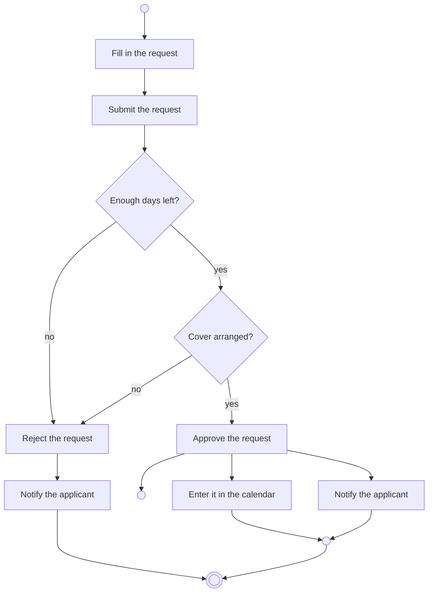

# Activity diagram

## Table of contents

- [What it is for](#what-it-is-for)
- [Elements](#elements)
- [Example: a holiday request](#example-a-holiday-request)
- [Swimlanes](#swimlanes)
- [Telling it apart from its neighbours](#telling-it-apart-from-its-neighbours)
- [What the exam is looking for](#what-the-exam-is-looking-for)

## What it is for

[^1]
An activity diagram describes a flow: which steps happen in which order, where the path
branches, and what may run at the same time.

It is the UML counterpart to the [flowchart](01-flowchart.md), but it can do two things a
flowchart cannot:

- **Concurrency** — several steps run in parallel
- **Responsibility** — swimlanes show who carries out which step

That is why it is used both for program logic and for business processes.

## Elements

| Element | Notation | Meaning |
|---|---|---|
| Initial node | filled circle | start of the flow |
| Action | rectangle with rounded corners | one step of work |
| Edge | arrow | order |
| Decision node | diamond, one incoming edge | branch on a condition |
| Merge node | diamond, one outgoing edge | brings branches back together |
| Fork | thick bar, one incoming edge | everything after it runs at the same time |
| Join | thick bar, one outgoing edge | waits until **all** branches have arrived |
| Activity final node | circle with a filled core | the flow is finished |
| Flow final node | circle with a cross | only this branch ends, the rest keeps running |
| Swimlane | vertical or horizontal lane | who carries out the step |

Conditions on the edges of a branch are written in square brackets: `[amount > 1000]`.

## Example: a holiday request

After approval, *enter it in the calendar* and *notify the applicant* run concurrently —
neither depends on the other. The flow is only finished when both are done.

!!! note "About this drawing"

    Mermaid has no dedicated symbols for fork and join; the empty nodes stand in for
    them here. **In the exam they are drawn as a thick horizontal bar** — a bar with one
    incoming and several outgoing arrows is a fork, one with several incoming and one
    outgoing arrow is a join.

## Swimlanes

When the task asks *who* does what, the diagram is divided into lanes — one per role,
department or system. Each action sits in the lane of whoever carries it out. An edge
crossing a lane boundary is a handover.

| Employee | Manager | HR |
|---|---|---|
| Fill in the request | | |
| Submit the request → | check and approve → | record it |

## Telling it apart from its neighbours

| | Flowchart | Activity diagram | State diagram |
|---|---|---|---|
| describes | an algorithm | a flow | an object's lifetime |
| nodes are | statements | actions | states |
| concurrency | no | yes | limited |
| responsibilities | no | yes (lanes) | no |
| standardised in | DIN 66001 | UML | UML |

## What the exam is looking for

- **Actions are activities**: "check invoice", not "invoice check".
- **At least two edges leave a decision node**, and their conditions must be mutually
  exclusive and cover every case together. An `[else]` is allowed.
- **Fork and join come in pairs.** What was forked is joined again — otherwise it is
  unclear when the flow ends.
- **A join waits for all branches, a merge node waits for none.** That is the most common
  mistake: a diamond where a bar belongs.

[^1]: <https://en.wikipedia.org/wiki/Activity_diagram>
