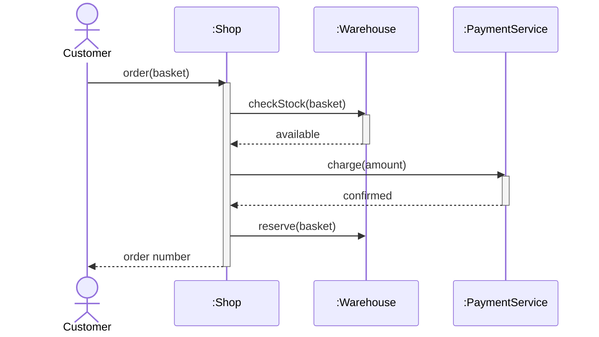
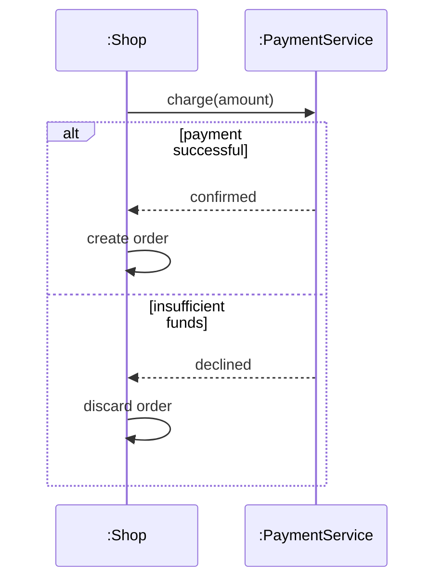

# Sequence diagram

## Table of contents

- [What it is for](#what-it-is-for)
- [Elements](#elements)
- [Example: placing an order](#example-placing-an-order)
- [Combined fragments](#combined-fragments)
- [Telling it apart](#telling-it-apart)
- [What the exam is looking for](#what-the-exam-is-looking-for)

## What it is for

[^1]
A sequence diagram shows which objects exchange messages in what **order in time**. Time
runs from top to bottom; the objects involved stand side by side along the top edge.

It always describes **one concrete run**, not every possible one — typically one use case
from the [use case diagram](04-use-case-diagram.md).

## Elements

| Element | Notation | Meaning |
|---|---|---|
| Object | rectangle at the top, `name:Class` | a participant in the run |
| Lifeline | dashed vertical line | the time during which the object exists |
| Activation bar | narrow rectangle on the lifeline | the object is currently working |
| Synchronous message | solid arrow, filled head | the sender waits for the reply |
| Asynchronous message | solid arrow, open head | the sender does not wait |
| Reply | dashed arrow | return to the caller |
| Creation | arrow onto the object rectangle, `<<create>>` | the object comes into being mid-run |
| Destruction | cross at the end of the lifeline, `<<destroy>>` | the object is cleared away |

A message is labelled with the call it triggers: `checkStock(articleNo)`.

## Example: placing an order

Read it like this: the customer calls `order` and waits. The shop asks the warehouse,
then charges the payment service, reserves the goods, and only then returns the order
number.

## Combined fragments

Branches and repetitions sit in a frame with a keyword in the top left corner:

| Keyword | Meaning |
|---|---|
| `alt` | Alternative — several sections separated by a dashed line; exactly one runs |
| `opt` | Optional — the section only runs if the condition holds |
| `loop` | Repetition, often with a range such as `loop [1..n]` |
| `par` | Parallel — the sections run concurrently |
| `ref` | Reference to another sequence diagram |

## Telling it apart

| | Sequence diagram | Activity diagram |
|---|---|---|
| Focus | who talks to whom, in what order | what happens, in what order |
| Participants | explicit, as lifelines | only through swimlanes |
| Branching | combined fragment `alt` | decision node |
| Time axis | vertical and explicit | implied by the edges |

## What the exam is looking for

- **Order is the vertical axis.** A message higher up happens earlier. Two arrows at the
  same height do not mean simultaneity — `par` is what says that.
- **Objects, not classes.** The lifeline belongs to `c1:Customer`, not to `Customer`. The
  object name may be omitted (`:Customer`), the colon may not.
- **Every synchronous message has a reply**, even one that returns nothing — otherwise it
  is not visible when the caller continues. For asynchronous messages the reply is
  deliberately absent.
- **An object may call itself.** The arrow then loops back onto its own lifeline and
  produces a second activation bar on top of the first.
- To derive a sequence diagram from a text, look for the **nouns** to get the objects and
  the **verbs** to get the messages.

[^1]: <https://en.wikipedia.org/wiki/Sequence_diagram>
