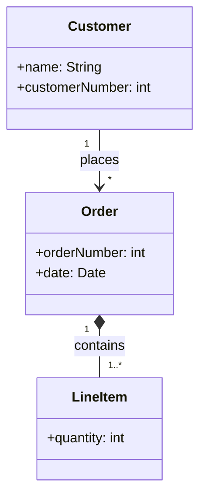
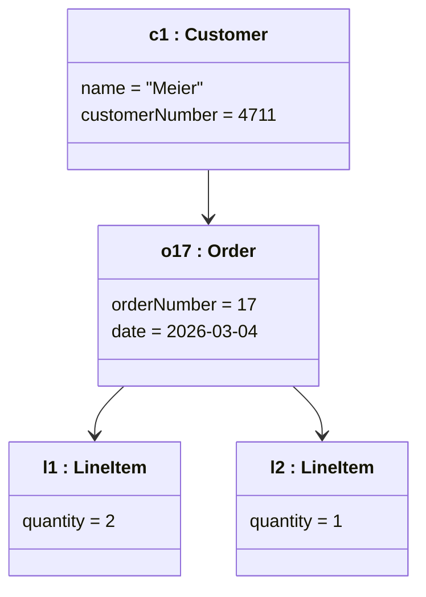

# Object diagram

## Table of contents

- [What it is for](#what-it-is-for)
- [Notation](#notation)
- [Example](#example)
- [When an object diagram contradicts its class diagram](#when-an-object-diagram-contradicts-its-class-diagram)
- [What the exam is looking for](#what-the-exam-is-looking-for)

## What it is for

[^1]
An object diagram shows a **snapshot**: which objects exist at a particular moment, what
values their attributes hold, and how they are linked to each other.

It relates to the [class diagram](03-class-diagram.md) as an example relates to a rule:

| Class diagram | Object diagram |
|---|---|
| class `Customer` | object `c1:Customer` |
| attribute `name: String` | value `name = "Meier"` |
| association `Customer 1 — * Order` | link between `c1` and `o17` |
| always true | true at this one moment |
| multiplicity `1..*` | exactly three objects hang off it |

In exam tasks it appears in one of two shapes: derive a valid object diagram from a class
diagram, or check whether a given object diagram is consistent with one.

## Notation

| Element | Notation |
|---|---|
| Named object | `c1:Customer` — **underlined** |
| Anonymous object | `:Customer` — the colon stays |
| Name only, class unknown | `c1` |
| Attribute values | in the lower compartment, `name = "Meier"` |
| Link | line between two objects, without multiplicity |

The **underline** is what distinguishes an object from a class. It is the detail an exam
uses to see whether the difference has been understood.

An object has **no multiplicities** and **no methods** — it has values. Methods live in
the class.

## Example

Class diagram (the rule):

Object diagram (one moment):

Customer `c1` has exactly one order, and that order has two line items. This is consistent
with the multiplicity `1..*` — it would also be consistent with `2..*`, but not with
`3..*`.

!!! note "About this drawing"

    Mermaid has no object diagram of its own; the objects are drawn here as classes with
    instance names. **In the exam the object name is underlined** (<u>c1 : Customer</u>) —
    that is the actual difference from a class diagram, and it carries marks.

## When an object diagram contradicts its class diagram

The usual errors that exam tasks ask about:

- **Multiplicity violated** — an order with no line item where `1..*` is required
- **Link without an association** — two objects are connected whose classes have nothing
  to do with each other in the class diagram
- **Attribute missing or extra** — an object carries a value its class does not define
- **Wrong type** — `quantity = "two"` where the class says `int`
- **Composition used more than once** — one part hangs off two wholes, although a
  composition allows exactly one

## What the exam is looking for

- **Underline the object name.** Without the underline it is a class diagram.
- **The colon stays even on an anonymous object**: `:Customer`, not `Customer`.
- **Links carry no multiplicities.** The count follows from how many objects are actually
  drawn.
- **Concrete values, not types.** `name = "Meier"` instead of `name: String`.
- An object diagram shows a single point in time. To show a course of events you need a
  [sequence diagram](08-sequence-diagram.md) or a [state diagram](06-state-diagram.md).

[^1]: <https://en.wikipedia.org/wiki/Object_diagram>
